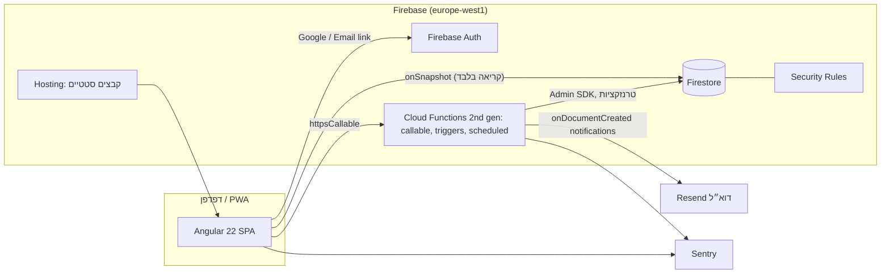

# מערכת תיאום חדרים — מסמך עיצוב טכני, חלופה ב׳: Firebase + Angular SPA

**גרסה:** 1.0  
**תאריך:** 3 בספטמבר 2026  
**מבוסס על:** `plans.md` גרסה 1.3  
**חלופה ל:** `design.md` (Next.js + Supabase)  
**קהל יעד:** המפתח/ת של ה-MVP

---

## 1. מטרה והיקף

מסמך זה מציג מימוש חלופי לאותו אפיון: צד השרת על Firebase (Auth, Firestore, Cloud Functions, Hosting) והלקוח כאפליקציית Angular 22 ללא SSR, כלומר SPA סטטית שנפרסת ל-Firebase Hosting. הדרישות הפונקציונליות, המצבים, קריטריוני הקבלה ומודל ההרשאות זהים ל-`plans.md`. מה שמשתנה הוא איך מבטיחים אותם.

הפרק האחרון (§20) משווה בין שתי החלופות ומצביע על ההבדלים שחשוב להכריע לפיהם.

**עקרונות מנחים לחלופה זו**

1. **קריאות ישירות מ-Firestore, כתיבות דרך Cloud Functions בלבד.** הלקוח מאזין בזמן אמת לנתונים שהוא רשאי לראות; כל שינוי עובר בפונקציה שמריצה טרנזקציה, ולידציה, ביקורת והודעה. Security Rules חוסמות כתיבה ישירה לכל אוסף עסקי.
2. **הפרטיות נבנית במודל הנתונים, לא בקוד סינון.** ל-Firestore אין הרשאות ברמת שדה. לכן מה שמטפל רשאי לראות על אחרים נשמר באוסף נפרד שאינו מכיל דבר מעבר לכך.
3. **מסמך אחד לכל חדר ליום הוא המנעול.** Firestore מבטיח טרנזקציות סריאליות על מסמכים; כל ההזמנות של חדר ביום מסוים עוברות דרך מסמך אחד, וכך אין הזמנה כפולה.
4. **קוד משותף ללקוח ולפונקציות.** חישובי זמן, משבצות, הרחבת ססיות, ולידציה ו-ICS נמצאים בחבילה משותפת ונבדקים פעם אחת.
5. **UTC לאירועים, זמן מקומי לכללים.** כמו בחלופה א׳.

## 2. סקירת ארכיטקטורה



**זרימת בקשה טיפוסית (יצירת הזמנה):**

1. הלקוח מאזין ל-`sites/{siteId}/roomDays` של היום הנבחר ומציג את היומן. הרשימה מתעדכנת בזמן אמת.
2. המשתמש בוחר משבצת ומאשר. הלקוח קורא ל-callable `createBooking` עם `{ id, siteId, roomId, startAt, note }`.
3. הפונקציה מאמתת את הטוקן, בונה `Actor`, מוודאת קלט ב-zod, ומריצה טרנזקציית Firestore: קוראת את `roomDays/{roomId}_{date}`, המתחם והסגירות, מריצה את הבדיקות, וכותבת את מסמך ההזמנה, את המרווח במסמך היום, אירוע ביקורת ומסמך הודעה.
4. טריגר `onDocumentCreated('notifications/{id}')` שולח את הדוא״ל.
5. הלקוח מקבל תשובה; היומן כבר התעדכן דרך המאזין.

## 3. סטאק ונימוקים

| שכבה | בחירה | נימוק |
|---|---|---|
| לקוח | Angular 22, standalone, signals, zoneless, OnPush | ברירת המחדל המודרנית של Angular; ללא Zone.js; מצב ב-signals |
| UI | Angular Material 3 + CDK | דיאלוגים, טאבים, select, date picker נגישים עם תמיכת bidi מובנית |
| טפסים | Signal Forms (`@angular/forms/signals`) עם zod לוולידציה משותפת | טפסים מבוססי signals; אם יתגלו פערים, Reactive Forms |
| Firebase בלקוח | AngularFire (`@angular/fire`) | `provideAuth`, `provideFirestore`, `provideFunctions`, אמולטורים |
| i18n | Transloco | החלפת שפה בזמן ריצה לפי העדפת המשתמש, בלי שני builds; `dir` דינמי |
| זמן | date-fns 4 + `@date-fns/tz` | זהה לחלופה א׳; רץ בלקוח ובפונקציות |
| הזדהות | Firebase Auth: Google + Email Link | Email Link הוא ה-passwordless המובנה; אין OTP מספרי מובנה |
| מסד נתונים | Firestore (Native mode), אזור `europe-west1` | מסמכים, טרנזקציות, מאזינים בזמן אמת, Rules |
| שרת | Cloud Functions 2nd gen, Node 22, TypeScript | callable לכתיבות, triggers לדוא״ל, scheduled לניסיונות חוזרים |
| דוא״ל | Resend דרך פונקציה | תבניות בקוד, he/en, RTL |
| ICS / CSV | קוד משותף ב-`shared` | ICS גם בלקוח (הורדה) וגם בפונקציה (צירוף למייל); CSV בלקוח |
| אירוח | Firebase Hosting | SPA עם rewrite ל-`index.html`, CDN, HTTPS אוטומטי |
| ניטור | Sentry (`@sentry/angular`, `@sentry/node`) + Cloud Logging | |
| בדיקות | Vitest (`ng test`), `@firebase/rules-unit-testing`, Emulator Suite, Playwright | |
| חבילות | pnpm workspace: `web/`, `functions/`, `shared/` | קוד משותף אחד |

**תכנית Firebase:** Blaze (תשלום לפי שימוש). נדרש ל-Cloud Functions 2nd gen, לקריאות רשת יוצאות (Resend) ול-Scheduled Functions. בהיקף העסק העלות החודשית הצפויה היא אפסית עד כמה דולרים, פרט ל-`minInstances` אם יבחרו להפעיל (ראו §8.1).

**למה לא Firebase Data Connect (Cloud SQL Postgres)?** הוא היה מחזיר את אילוץ ההדרה של Postgres, אבל דרך GraphQL מנוהל, בלי נעילות ולוגיקה טרנזקציונית מותאמת. משיגים את הפונקציונליות רק בפונקציות שמתחברות ל-Cloud SQL ישירות, ואז הפער מחלופה א׳ מיטשטש והעלות (Cloud SQL תמיד-פועל) גבוהה יותר. Firestore עם מסמך-יום לחדר הוא הפתרון האידיומטי.

**למה כתיבות רק בפונקציות ולא Rules בלבד?** כללי הזמנה (מקטעי פעילות, סגירות, חלון, חפיפה, ביקורת, הודעה) אינם ניתנים לביטוי ב-Rules. פונקציה אחת עם טרנזקציה פשוטה ובדיקה לבדיקה.

## 4. מבנה הפרויקט

```text
rooms/
  pnpm-workspace.yaml
  firebase.json                 # hosting, functions, firestore, emulators
  .firebaserc                   # dev / prod
  firestore.rules
  firestore.indexes.json
  shared/                       # @rooms/shared — ללא תלות ב-Angular או ב-Firebase
    src/
      time/                     # localToUtc, utcToLocal, dayBounds, isOnQuarter, overlaps
      slots/                    # validStartTimes(roomDay, openingHours, closures, window)
      recurrence/               # expand(series) → occurrences
      validation/               # סכמות zod לכל callable
      ics/
      csv/
      types.ts                  # DTOs, enums, ErrorCode
  functions/
    src/
      index.ts                  # ייצוא כל הפונקציות
      lib/                      # actor, guards, errors, audit, tx helpers, claims
      callables/                # ensureProfile, updateProfile, requestMembership, decideMembership,
                                # updateSite, setOpeningHours, upsertRoom, setRoomStatus,
                                # createBooking, moveBooking, cancelBooking,
                                # previewSeries, createSeries, splitSeries, cancelSeries,
                                # createClosure, deleteClosure, deleteMyAccount
      triggers/                 # notifications.onCreated
      scheduled/                # notifications.retry
      email/                    # templates he/en, resend client
    package.json                # build: esbuild bundle → lib/index.js
  web/                          # Angular 22
    src/
      app/
        core/                   # auth store (signals), firebase providers, guards, error mapping, i18n, theme/dir
        shared/                 # ui components, pipes (localTime), directives
        features/
          auth/                 # login
          onboarding/           # profile, site requests, pending
          calendar/             # day view (grid/list), booking dialog, room-day store
          bookings/             # my bookings, details
          profile/
          admin/
            dashboard/ calendar/ members/ bookings/ series/ rooms/ hours/ closures/ reports/ settings/ audit/
          legal/                # privacy, terms
        app.routes.ts
        app.config.ts           # provideZonelessChangeDetection, provideRouter, Firebase, Transloco
      assets/i18n/he.json, en.json
      manifest.webmanifest
    ngsw-config.json
  tests/
    rules/                      # בדיקות Security Rules מול אמולטור
    e2e/                        # Playwright מול אמולטורים
```

**כלל תלות:** `web/` ו-`functions/` תלויים ב-`shared/`; `shared/` אינו תלוי בדבר מלבד date-fns ו-zod.

## 5. הזדהות, זהות והרשאות

### 5.1 התחברות

- **Google:** `signInWithPopup(GoogleAuthProvider)`; ב-iOS Safari עדיף `signInWithRedirect`. AngularFire מספק `user$`/`authState`.
- **דוא״ל:** `sendSignInLinkToEmail` עם `actionCodeSettings.url = APP_URL/login/finish`; `isSignInWithEmailLink` + `signInWithEmailLink` בעמוד הסיום. הכתובת נשמרת ב-`localStorage` בין השלבים.
- Firebase Auth מקשר אוטומטית Google ודוא״ל עם אותה כתובת מאומתת כאשר "One account per email address" מופעל (ברירת מחדל).

### 5.2 פרופיל ואתחול מנהל-על

אין טריגר על יצירת משתמש (2nd gen דורש Identity Platform). במקום זה הלקוח קורא ל-callable `ensureProfile` מיד אחרי כל התחברות:

```ts
// functions/src/callables/ensureProfile.ts
export const ensureProfile = onCall({ region }, async (req) => {
  const { uid, token } = requireAuth(req);
  const ref = db.doc(`users/${uid}`);
  await db.runTransaction(async (tx) => {
    const snap = await tx.get(ref);
    if (snap.exists) return;
    const isAdmin = token.email_verified && token.email === SUPER_ADMIN_EMAIL.value()
                    && !(await tx.get(db.collection('users').where('role', '==', 'SUPER_ADMIN').limit(1))).size;
    tx.set(ref, { email: token.email, fullName: null, locale: 'he', role: isAdmin ? 'SUPER_ADMIN' : 'THERAPIST',
                  status: 'ACTIVE', claimsVersion: 1, createdAt: now(), updatedAt: now() });
    if (isAdmin) audit(tx, { action: 'ROLE_GRANTED', entityType: 'user', entityId: uid, actor: null });
  });
  if (isAdmin) await auth.setCustomUserClaims(uid, { role: 'SUPER_ADMIN' });
  return { ok: true };
});
```

### 5.3 Custom Claims כמקור ההרשאות ב-Rules

הטוקן נושא:

```json
{ "role": "SUPER_ADMIN" | "THERAPIST", "sites": { "<siteId>": true }, "v": 3 }
```

- `sites` מכיל רק חברויות `APPROVED`. `decideMembership` מעדכן את החברות, מחשב מחדש את ה-claims מכל חברויות המשתמש, קורא ל-`setCustomUserClaims`, ומגדיל `users/{uid}.claimsVersion`.
- הלקוח מאזין ל-`users/{uid}`; כש-`claimsVersion` גדול מ-`v` שבטוקן הנוכחי הוא קורא ל-`getIdToken(true)`. כך אישור מתבטא במסך המטפל בתוך שניות.
- הפונקציות **אינן** סומכות על claims לבדיקות עסקיות; הן קוראות את מסמך החברות בטרנזקציה. ה-claims משמשים את ה-Rules לקריאות בלבד.

### 5.4 Actor ו-guards בפונקציות

```ts
type Actor = { uid: string; role: Role; locale: 'he'|'en'; status: UserStatus; email: string };

requireAuth(req): { uid, token }                 // HttpsError('unauthenticated')
loadActor(tx?, uid): Actor                       // קורא users/{uid}; DISABLED → 'permission-denied'
requireAdmin(actor)
requireApprovedMember(tx, siteId, uid)           // קורא sites/{siteId}/memberships/{uid}
canManageBooking(actor, booking): boolean
```

שגיאות עסקיות נזרקות כ-`HttpsError('failed-precondition' | 'already-exists' | 'permission-denied' | 'not-found' | 'invalid-argument', message, { code: ErrorCode, details, requestId })`. הלקוח ממפה `details.code` להודעה מתורגמת.

## 6. מודל הנתונים ב-Firestore

### 6.1 אוספים

```text
users/{uid}
  email, fullName, locale, role, status, claimsVersion, createdAt, updatedAt

sites/{siteId}
  name, address, timezone, bookingWindowDays, cancellationCutoffMinutes, status,
  openingHours: { "0": [{start:"08:00", end:"13:00"}, ...], ..., "6": [] }     // weekday → מקטעים
  createdAt, updatedAt

sites/{siteId}/rooms/{roomId}
  roomNumber, displayOrder, status, createdAt, updatedAt

sites/{siteId}/memberships/{uid}
  status, requestedAt, decidedAt, decidedBy, userName, userEmail            // denormalized למסך המנהל

sites/{siteId}/closures/{closureId}
  roomId | null, startAt, endAt, reason, createdBy, createdAt

sites/{siteId}/roomDays/{roomId}_{YYYY-MM-DD}                                  // מנעול + תצוגת תפוסה
  roomId, date, intervals: [ { s: Timestamp, e: Timestamp } ]                 // ממוין, ללא חפיפה, ללא מזהים
  updatedAt

bookings/{bookingId}                                                           // מזהה שנוצר בלקוח
  siteId, roomId, roomNumber, userId, userName, date, startAt, endAt, durationMinutes,
  type: 'REGULAR'|'SERIES', status: 'CONFIRMED'|'CANCELLED', note, seriesId | null, isException,
  version, createdBy, updatedBy, cancelledAt, cancelledBy, cancellationReason, createdAt, updatedAt

sites/{siteId}/series/{seriesId}
  roomId, userId, userName, weekday, startTime, endTime, startsOn, endsOn, note, status,
  skippedDates: [ "YYYY-MM-DD" ], createdBy, updatedBy, createdAt, updatedAt

notifications/{id}
  userId, email, type, locale, payload, status: 'PENDING'|'SENT'|'FAILED', attempts, lastError, createdAt, sentAt

auditEvents/{id}
  siteId | null, actorUid | null, action, entityType, entityId, before, after, requestId, createdAt
```

### 6.2 הערות על המודל

- **`roomDays` הוא הלב.** מסמך אחד לכל חדר ליום מקומי. הוא משמש בו-זמנית כמנעול (כל שינוי בחדר באותו יום עובר בטרנזקציה עליו) וכתצוגת התפוסה שמטפל רשאי לראות (`intervals` ללא מזהה, שם או הערה). הזמנה אינה חוצה יום מקומי, ולכן מיפוי הזמנה ↔ מסמך יום הוא חד-ערכי. ביטול מסיר את המרווח לפי `(s, e)`; מכיוון שמרווחים בחדר אינם חופפים, הזוג מזהה את המרווח באופן ייחודי.
- **`bookings` ברמה עליונה** כדי לאפשר שאילתת „ההזמנות שלי” אחת חוצת מתחמים (`where userId == uid`) ושאילתות דוחות למנהל. שדות `roomNumber` ו-`userName` מועתקים כדי שרשימות ודוחות לא יצטרכו קריאות נוספות; שינוי שם מטפל אינו מעדכן היסטוריה (מקובל).
- **`openingHours` מוטמע במסמך המתחם.** שבעה ימים עם כמה מקטעים הם מבנה קטן; קריאה אחת בטרנזקציה.
- **`memberships` תחת המתחם** כדי ש-Rules יוכלו לאפשר למנהל לקרוא רשימה לפי מתחם, ולמשתמש לקרוא רק את שלו.
- **`closures`** נקראות בידי חברים, כולל `reason`. ל-Firestore אין הסתרת שדה; הסיבה נחשבת מידע תפעולי לא רגיש („חג”, „תחזוקה”). זו סטייה קטנה מחלופה א׳ שבה הסיבה הוצגה למנהל בלבד.
- **`date`** בהזמנה, ב-`roomDays` וב-`closures` (בסגירה: אין, כי היא חוצה ימים) הוא תאריך מקומי `YYYY-MM-DD` לשאילתות שוויון פשוטות.
- **מחיקה פיזית** של מסמכי `bookings` נעשית רק בפיצול סדרה (§8.6), בטרנזקציה עם ביקורת.

### 6.3 אינדקסים

`firestore.indexes.json`:

| אוסף | שדות | שימוש |
|---|---|---|
| `bookings` | `userId ASC, startAt DESC` | ההזמנות שלי |
| `bookings` | `siteId ASC, date ASC, status ASC` | יומן מנהל ליום |
| `bookings` | `siteId ASC, status ASC, startAt ASC` | דוחות, התנגשויות סגירה, השבתת חדר |
| `bookings` | `seriesId ASC, startAt ASC` | מופעי סדרה |
| `roomDays` (collection group לא נדרש) | `date ASC` | יומן יום למתחם |
| `notifications` | `status ASC, createdAt ASC` | ניסיונות חוזרים |
| `auditEvents` | `siteId ASC, createdAt DESC` | מסך ביקורת |

### 6.4 Security Rules

```js
rules_version = '2';
service cloud.firestore {
  match /databases/{db}/documents {
    function signedIn()       { return request.auth != null; }
    function isAdmin()        { return signedIn() && request.auth.token.role == 'SUPER_ADMIN'; }
    function isMember(siteId) { return isAdmin() || (signedIn() && request.auth.token.sites[siteId] == true); }
    function isSelf(uid)      { return signedIn() && request.auth.uid == uid; }

    // כתיבה ישירה אסורה בכל מקום. כל הכתיבות דרך Cloud Functions (Admin SDK עוקף Rules).
    match /{document=**} { allow write: if false; }

    match /users/{uid}                          { allow read: if isSelf(uid) || isAdmin(); }
    match /sites/{siteId} {
      allow read: if signedIn();                                          // רשימת מתחמים לבקשת הצטרפות
      match /rooms/{roomId}                     { allow read: if isMember(siteId); }
      match /memberships/{uid}                  { allow read: if isSelf(uid) || isAdmin(); }
      match /closures/{id}                      { allow read: if isMember(siteId); }
      match /roomDays/{id}                      { allow read: if isMember(siteId); }
      match /series/{id}                        { allow read: if isAdmin() || (signedIn() && resource.data.userId == request.auth.uid); }
    }
    match /bookings/{id}                        { allow read: if isAdmin() || (signedIn() && resource.data.userId == request.auth.uid); }
    match /auditEvents/{id}                     { allow read: if isAdmin(); }
    match /notifications/{id}                   { allow read: if false; }
  }
}
```

הערות:

- שאילתת „ההזמנות שלי” חייבת לכלול `where('userId', '==', uid)`, אחרת ה-Rules דוחות אותה (Firestore בודק שהשאילתה מוכלת בכלל).
- `sites` נקרא לכל מחובר כדי להציג את רשימת המתחמים ב-onboarding. המסמך מכיל שם, כתובת ושעות פעילות; אין בו מידע רגיש.
- הבדיקות ב-`tests/rules` מוכיחות: מטפל במתחם א׳ אינו קורא `roomDays` של ב׳; מטפל אינו קורא `bookings` של אחר; אף אחד אינו כותב ישירות.

## 7. זמן ואזור זמן

זהה לחלופה א׳ (`design.md` §7), ממומש ב-`shared/time` ומשמש גם את הלקוח וגם את הפונקציות. הבדל יחיד: ב-Firestore הזמנים הם `Timestamp`; ההמרה ל-`Date` נעשית בגבול (`toDate()` / `Timestamp.fromDate`). ב-`shared` הכול `Date`.

## 8. לוגיקה עסקית מרכזית (Cloud Functions)

### 8.1 תבנית callable

```ts
export const createBooking = onCall({ region: 'europe-west1', enforceAppCheck: false, minInstances: 0 }, async (req) => {
  const requestId = randomUUID();
  try {
    const { uid } = requireAuth(req);
    const input = createBookingSchema.parse(req.data);
    return await bookings.create({ uid, requestId }, input);
  } catch (e) { throw toHttpsError(e, requestId); }   // AppError → HttpsError עם code; אחר → Sentry + 'internal'
});
```

`minInstances: 1` על `createBooking` בייצור מוריד cold start מ-1–3 שניות לאפס, בעלות של כמה דולרים בחודש. ברירת המחדל ל-MVP: 0, ולהפעיל רק אם המטפלים מתלוננים.

### 8.2 בדיקות משותפות (`assertBookable`)

מקבלת `{ site, room, membership, roomDay, closures, range, actor, isAdminAction, ignoreInterval? }` ומריצה את אותה טבלה כמו `design.md` §8.2:

| בדיקה | קוד |
|---|---|
| חדר פעיל ושייך למתחם | `NOT_FOUND` |
| למטפל חברות `APPROVED` | `MEMBER_NOT_APPROVED` |
| התחלה על רבע שעה מקומית | `INVALID_START_STEP` |
| טווח בתוך מקטע פעילות אחד (`site.openingHours[weekday]`) | `OUTSIDE_OPENING_HOURS` |
| לא חופף סגירה (של החדר או של המתחם) | `CLOSED` |
| התחלה בעתיד (מטפל) | `PAST_START` |
| בתוך חלון ההזמנה (מטפל) | `OUTSIDE_BOOKING_WINDOW` |
| לא חופף מרווח ב-`roomDay.intervals` (מלבד `ignoreInterval`) | `SLOT_TAKEN` |

הפונקציה טהורה ונמצאת ב-`shared/slots`, כך שהלקוח משתמש בה לחישוב שעות ההתחלה התקפות והפונקציה לאכיפה.

### 8.3 יצירת הזמנה

```ts
db.runTransaction(async (tx) => {
  const [bookingSnap, siteSnap, roomSnap, memSnap, roomDaySnap, closuresSnap] = await Promise.all([
    tx.get(bookingRef), tx.get(siteRef), tx.get(roomRef), tx.get(memRef), tx.get(roomDayRef),
    tx.get(closuresQuery(siteId, range)),
  ]);
  if (bookingSnap.exists) return sameRequest(bookingSnap, input) ? bookingSnap.data() : throw VALIDATION;
  if (input.forUserId && input.forUserId !== actor.uid) requireAdmin(actor);
  assertBookable(...);
  const roomDay = roomDaySnap.exists ? roomDaySnap.data() : { roomId, date, intervals: [] };
  roomDay.intervals = insertSorted(roomDay.intervals, { s: start, e: end });
  tx.set(roomDayRef, roomDay);
  tx.set(bookingRef, booking);
  audit(tx, ...); enqueue(tx, ...);
});
```

Firestore מריץ טרנזקציות באופטימיות עם ניסיונות חוזרים: אם `roomDay` השתנה בין הקריאה לכתיבה, הטרנזקציה רצה שוב וה-`SLOT_TAKEN` נזרק בסיבוב הבא. עשרים בקשות מקבילות → אחת מצליחה.

### 8.4 שינוי

טרנזקציה שקוראת את ההזמנה, את `roomDay` הישן והחדש (עשויים להיות אותו מסמך), מסירה את המרווח הישן, מריצה `assertBookable` על החדש, מוסיפה, ומעדכנת את ההזמנה (`version + 1`, `isException` אם ססיה). `canManageBooking` לפני הכול.

### 8.5 ביטול

טרנזקציה: ההזמנה → `CANCELLED`; הסרת `(s, e)` מ-`roomDay`; ביקורת; הודעה (למטפל אם ביטל מנהל; למנהל אם מטפל ביטל מופע ססיה, בכפוף לפרמטר `THERAPIST_CAN_CANCEL_OCCURRENCE`).

### 8.6 ססיות

- **`expand`** ב-`shared/recurrence`, טהור, זהה לחלופה א׳.
- **`previewSeries`**: קורא (מחוץ לטרנזקציה) את המתחם, הסגירות בטווח ואת כל `roomDays` של החדר בתאריכי המופעים (`getAll` של עד 52 מסמכים). מחזיר רשימת מופעים עם התנגשויות. ללא כתיבה.
- **`createSeries`**: טרנזקציה אחת: `getAll` של אותם מסמכים בתוך הטרנזקציה, חישוב מחדש, ואם אין התנגשויות (או `skipConflicts`) כתיבת מסמך הסדרה, עד 52 `bookings`, עד 52 `roomDays`, ביקורת והודעה. סה״כ עד ~110 כתיבות, בתוך מגבלת 500 של Firestore.
- **`splitSeries`**: טרנזקציה אחת: קריאת הסדרה, המופעים העתידיים (`seriesId == X and startAt >= from`), ה-`roomDays` שלהם וה-`roomDays` של המופעים החדשים. מחיקת המופעים הישנים והסרת המרווחים; סיום הסדרה הישנה (`endsOn = from - 1`); יצירת סדרה חדשה ומופעים כמו ב-`createSeries`. עד ~52×2 מחיקות/עדכונים + 52×2 יצירות ≈ 210 כתיבות. ביקורת `SERIES_SPLIT` אחת.
- **`cancelSeries`**: טרנזקציה: מופעים עתידיים → `CANCELLED`, הסרה מ-`roomDays`, סדרה → `CANCELLED`.

אם בעתיד ירצו ססיות ארוכות מ-52 שבועות, יש לפצל לכמה טרנזקציות; לא נדרש ב-MVP.

### 8.7 סגירות

`createClosure`: שאילתה (מחוץ לטרנזקציה) של הזמנות `CONFIRMED` במתחם/חדר החופפות לטווח. אם יש ו-`cancelConflicts` false → `CONFLICTS` עם רשימה (שמות, שעות). אחרת טרנזקציה: קריאה מחדש של ההזמנות המתנגשות וה-`roomDays` שלהן, ביטולן, הסרת המרווחים, כתיבת הסגירה, ביקורת, הודעה לכל מטפל. סגירה ארוכה של מתחם שלם עלולה לגעת בעשרות מסמכים; עדיין בתוך המגבלה.

הערת תחרות: בין השאילתה לטרנזקציה יכולה להיווצר הזמנה חדשה בטווח הסגירה. `createBooking` קורא את `closures` בתוך הטרנזקציה, אבל הסגירה עדיין לא נכתבה. הפתרון: `createClosure` כותב בתחילת הטרנזקציה מסמך `closures/{id}` ו-`createBooking` קורא את הסגירות באותה טרנזקציה; Firestore מבטיח סריאליות בין השתיים כי שתיהן קוראות וכותבות את אותם `roomDays`. לכן הסגירה **חייבת** לגעת בכל `roomDays` בטווח (עדכון `updatedAt`) גם אם אין בהם מרווחים, כדי לייצר את הקונפליקט. זה גם מגביל סגירה יחידה ל-~400 ימי-חדר; מספיק בהרבה.

### 8.8 חדרים ושעות פעילות

- `setRoomStatus(INACTIVE)`: שאילתה של הזמנות עתידיות `CONFIRMED` בחדר → `ROOM_HAS_FUTURE_BOOKINGS` עם רשימה.
- `setOpeningHours(siteId, weekday, segments)`: ולידציה, כתיבה למסמך המתחם, אזהרות על הזמנות עתידיות שיוצאות מהשעות (שאילתה). ביקורת.

### 8.9 מחיקת חשבון

`deleteMyAccount`: `users/{uid}` → `DISABLED`, שם ודוא״ל מאונמזים, חברויות → `SUSPENDED`, `auth.deleteUser(uid)`. הזמנות וביקורת נשארות (עם `userName` ההיסטורי, כמו בחלופה א׳).

## 9. ממשקי השרת

### 9.1 Callables

| פונקציה | קלט | הרשאה |
|---|---|---|
| `ensureProfile` | — | מחובר |
| `updateProfile` | fullName, locale | מחובר |
| `requestMembership` | siteId | מחובר |
| `decideMembership` | siteId, uid, status | מנהל |
| `updateSite` | siteId, name, address, bookingWindowDays, cancellationCutoffMinutes | מנהל |
| `setOpeningHours` | siteId, weekday, segments[] | מנהל |
| `upsertRoom` / `reorderRooms` / `setRoomStatus` | … | מנהל |
| `createBooking` | id, siteId, roomId, startAt, note, forUserId? | חבר / מנהל |
| `moveBooking` | bookingId, roomId, startAt | בעלים / מנהל |
| `cancelBooking` | bookingId, reason? | בעלים / מנהל |
| `previewSeries` / `createSeries` / `splitSeries` / `cancelSeries` | … | מנהל |
| `createClosure` / `deleteClosure` | … | מנהל |
| `deleteMyAccount` | — | מחובר |

### 9.2 קריאות (ישירות מהלקוח)

| מסך | שאילתה |
|---|---|
| יומן מטפל | `sites/S/roomDays where date == D`; `sites/S/closures where endAt > dayStart` (סינון `startAt < dayEnd` בלקוח); `bookings where userId == uid and date == D` להדגשת „שלי” |
| יומן מנהל | כמו מעלה + `bookings where siteId == S and date == D and status == CONFIRMED` |
| ההזמנות שלי | `bookings where userId == uid orderBy startAt desc` (עתידיות/היסטוריה בלקוח) |
| חברים | `sites/S/memberships` |
| ססיות | `sites/S/series` |
| דוחות | `bookings where siteId == S and status == CONFIRMED and startAt in [from, to)`; אגרגציה בלקוח |
| ביקורת | `auditEvents where siteId == S orderBy createdAt desc limit 100` + `startAfter` |

כל הקריאות דרך `collectionData`/`docData` של AngularFire ו-`toSignal`, כך שהיומן מתעדכן בזמן אמת בלי רענון.

### 9.3 Triggers ו-Scheduled

| פונקציה | טריגר | תפקיד |
|---|---|---|
| `notificationsOnCreated` | `onDocumentCreated('notifications/{id}')` | רינדור ושליחה; `SENT`/`FAILED` |
| `notificationsRetry` | `onSchedule('every 10 minutes')` | שליחה חוזרת ל-`FAILED` עם `attempts < 5` |

### 9.4 קודי שגיאה

זהים ל-`design.md` §9.4, מועברים ב-`HttpsError.details.code`. הלקוח: `mapHttpsError(err) → ErrorCode` → `transloco.translate('errors.' + code)`.

## 10. הודעות (דוא״ל)

- **Outbox:** מסמך `notifications/{id}` נכתב בטרנזקציה של הפעולה העסקית עם `payload` מלא (מתחם, חדר, שעות מקומיות, סוג, קישור, ICS כטקסט).
- **שליחה:** הטריגר `onDocumentCreated` מרנדר תבנית לפי `type` ו-`locale` (פונקציות TS שמחזירות HTML עם `dir`), קורא ל-Resend, ומעדכן את המסמך. טריגרים של Firestore הם at-least-once; הפונקציה בודקת `status == 'PENDING'` לפני שליחה כדי לא לשלוח פעמיים.
- **ניסיון חוזר:** פונקציה מתוזמנת כל 10 דקות שולפת `FAILED` עם `attempts < 5` ומנסה שוב. אחרי 5 כשלונות: Sentry.
- **סוגים:** זהים ל-`design.md` §10.3.

## 11. ICS

`shared/ics/build(booking, site, locale)` מחזיר טקסט ICS עם `UID`, `SEQUENCE = version`, `VTIMEZONE` ל-`Asia/Jerusalem`. בלקוח: כפתור „הוסף ליומן” יוצר `Blob` ומוריד (`<a download>` בתוך האפליקציה עצמה; אין מגבלה כי זו אפליקציה רגילה ולא sandbox). בפונקציה: אותו קוד מצרף את הקובץ למייל.

## 12. דוחות ו-CSV

הלקוח של המנהל שולף את ההזמנות בטווח (בעסק זה כמה מאות עד אלפים בחודש) ומחשב ב-`computed()`:

- סיכום שעות לפי מטפל ולפי חדר, עם פיצול רגילות/ססיה (`durationMinutes / 60`).
- פירוט הזמנות עם מסננים (חדר, מטפל, סוג, מצב) שמופעלים על הרשימה בזיכרון.

`shared/csv/toCsv` מייצר טקסט עם BOM וכותרות מתורגמות; הורדה כ-Blob. אזהרת מידע אישי לפני ההורדה. אם הנפח יגדל (עשרות אלפי הזמנות בטווח), אפשר להעביר לפונקציה callable שמחזירה CSV; לא נדרש ב-MVP.

## 13. יומן ביקורת

`audit(tx, ...)` כותב מסמך ב-`auditEvents` בתוך אותה טרנזקציה. `before`/`after` מכילים רק שדות רלוונטיים. מסך המנהל קורא ישירות עם דפדוף `startAfter`. אין אפשרות עריכה: Rules אוסרות כתיבה מהלקוח, והפונקציות לעולם לא מעדכנות אירועים.

## 14. הלקוח: Angular 22

### 14.1 תצורה

```ts
// app.config.ts
export const appConfig: ApplicationConfig = {
  providers: [
    provideZonelessChangeDetection(),
    provideRouter(routes, withComponentInputBinding(), withViewTransitions()),
    provideFirebaseApp(() => initializeApp(environment.firebase)),
    provideAuth(() => { const a = getAuth(); if (environment.emulators) connectAuthEmulator(a, 'http://127.0.0.1:9099'); return a; }),
    provideFirestore(() => { const f = getFirestore(); if (environment.emulators) connectFirestoreEmulator(f, '127.0.0.1', 8080); return f; }),
    provideFunctions(() => { const fn = getFunctions(undefined, 'europe-west1'); if (environment.emulators) connectFunctionsEmulator(fn, '127.0.0.1', 5001); return fn; }),
    provideTransloco({ config: { availableLangs: ['he', 'en'], defaultLang: 'he', reRenderOnLangChange: true }, loader: TranslocoHttpLoader }),
    provideAnimationsAsync(),
    { provide: MAT_DATE_LOCALE, useValue: 'he-IL' }, provideDateFnsAdapter(),
  ],
};
```

- Firestore offline persistence **לא** מופעל (ברירת מחדל: memory cache). מונע הצגת נתונים ישנים כעדכניים.
- `dir` ו-`lang` על `<html>` מעודכנים ב-`LocaleService` בכל החלפת שפה; Angular Material מזהה RTL דרך `Directionality`.

### 14.2 מבנה הקוד

- **Standalone components בלבד**, `ChangeDetectionStrategy.OnPush`, `inject()`, `input()`/`output()`, `@if`/`@for`/`@switch`, host bindings ב-`host`.
- **State:** signals. אין NgRx. שירותים `providedIn: 'root'`:
  - `AuthStore`: `user = toSignal(authState)`, `profile = toSignal(docData(users/uid))`, `claims`, `isAdmin = computed(...)`, רענון טוקן לפי `claimsVersion`.
  - `SiteStore`: מתחם נבחר (מה-URL), רשימת מתחמים מאושרים.
  - `RoomDayStore` (scoped לרכיב היומן): `date` signal → `toSignal(collectionData(query))` עם `switchMap`; `computed` ל-`DayModel` (חדרים × בלוקים × משבצות תקפות) באמצעות `shared/slots`.
  - `ApiService`: מעטפת ל-`httpsCallable` עם `ActionResult<T>` ומיפוי שגיאות.
- **Routes:** lazy per feature (`loadChildren`), guards פונקציונליים: `authGuard`, `onboardedGuard` (שם מולא + חברות מאושרת אחת לפחות, אחרת `/onboarding/pending`), `adminGuard`, `siteMemberGuard(siteId)`.
- **Forms:** Signal Forms עם סכמות zod מ-`shared/validation` (ולידציה אחת ללקוח ולשרת). אם רכיב Material כלשהו אינו משתלב, Reactive Forms לאותו טופס.
- **Errors:** `ErrorHandler` גלובלי → Sentry; toast עם `errors.<code>`.

### 14.3 יומן יום

**`DayGridComponent` (≥ 768px):** CSS Grid, עמודת זמן + עמודה לחדר, שורה לכל 15 דקות. תאים פנויים הם `<button>` עם `aria-label`; בלוקים ממוקמים ב-`grid-row`. ניווט מקלדת בחיצים דרך `@angular/cdk/a11y` (`FocusKeyManager`). לחיצה → `MatDialog` עם `BookingDialogComponent`.

**`DayListComponent` (< 768px):** `MatTabGroup` לחדרים; רשימה כרונולוגית עם מיזוג פרקי פנוי ו-`MatSelect` לשעת התחלה.

**`BookingDialogComponent`:** מציג מתחם, חדר, תאריך, שעת התחלה (select של שעות תקפות), סיום מחושב, הערה עם אזהרה, ולמנהל בורר מטפל. שולח `createBooking`; ב-`SLOT_TAKEN` מציג הודעה וסוגר. היומן כבר עדכני דרך המאזין.

**זמן אמת:** כשמטפל אחר מזמין, `roomDays` משתנה ורשת היומן מתעדכנת מיד. זה יתרון מובנה של החלופה.

### 14.4 מסכים

זהים ל-`design.md` §14.3–14.5, בנויים מ-Angular Material: `MatTable` לרשימות, `MatDialog` לאישורים, `MatDatepicker` לתאריכים (עם `he-IL`), `MatSnackBar` ל-toast (`aria-live` מובנה), `MatStepper` לטופס הססיה הדו-שלבי.

### 14.5 PWA

`ng add @angular/pwa`: מייצר `manifest.webmanifest`, אייקונים ו-`ngsw-config.json`. ה-Service Worker של Angular מטמין את קבצי האפליקציה בלבד (`assetGroups`); אין `dataGroups`, כך שאין מטמון נתונים. `SwUpdate` מציג „גרסה חדשה זמינה, רענן”. Firebase Hosting מגיש עם `Cache-Control` נכון ל-`ngsw.json`.

### 14.6 נגישות ו-i18n

- Material מספק focus trap, roles ו-`aria` לדיאלוגים, טאבים ו-select. תוויות טקסט או סמל בכל בלוק; לא צבע בלבד.
- Transloco: `assets/i18n/{he,en}.json`, `TranslocoService.setActiveLang` לפי הפרופיל. תאריכים: `Intl.DateTimeFormat` עם `timeZone: site.timezone`.
- `@angular/localize` נשקל ונדחה: הוא דורש build לכל שפה ופריסה לשני נתיבים, והחלפת שפה היא reload; לעסק קטן עם העדפה אישית לשפה, Transloco פשוט יותר.

## 15. אבטחה

| נושא | מימוש |
|---|---|
| סשן | Firebase Auth SDK, טוקן ID מתחדש; `persistence: browserLocalPersistence` |
| כתיבות | רק דרך callables; Rules: `allow write: if false` גלובלי |
| קריאות | Rules לפי claims; בדיקות `rules-unit-testing` לכל כלל |
| צמצום מידע | `roomDays` ללא מזהים; `bookings` רק לבעלים/מנהל; בדיקת Rules שמטפל אינו קורא הזמנה זרה |
| App Check | לא ב-MVP (מוסיף reCAPTCHA ומורכבות); ניתן להפעיל בשלב שני |
| סודות | `functions/.env.<project>` + `defineSecret('RESEND_API_KEY')` (Secret Manager); אף סוד לא בלקוח |
| מפתחות Firebase בלקוח | ציבוריים במכוון; הגנה ב-Rules ובהגבלת API key לדומיין ב-Google Cloud Console |
| כותרות | `firebase.json` headers: HSTS, `X-Content-Type-Options`, `Referrer-Policy`, CSP בסיסי |
| לוגים | `requestId` בכל שגיאה; אין תוכן קישורי התחברות או payload |
| Google OAuth | מסך הסכמה עם `/privacy` ו-`/terms`; הדומיין המורשה ב-Firebase Auth |

## 16. בדיקות

### 16.1 Unit (Vitest)

- `shared/`: זמן ו-DST, `validStartTimes`, `insertSorted`/`removeInterval`, `expand`, ICS, CSV. חבילה ללא תלויות → הבדיקות המהירות והחשובות ביותר.
- `web/`: `ng test` (Vitest). רכיבי יומן עם `DayModel` מדומה; stores עם AngularFire מדומה.

### 16.2 פונקציות מול אמולטור

`functions/tests/` מריצים את השירותים העסקיים (לא דרך HTTP) מול Firestore Emulator עם Admin SDK:

- כל שורה ב-§8.2.
- תחרות: 20 קריאות מקבילות ל-`bookings.create` לאותה משבצת → אחת מצליחה.
- idempotency, move אטומי, ססיה נקייה/חלקית, פיצול, ביטול סדרה, סגירה עם ובלי ביטול מרוכז, השבתת חדר.
- outbox: טריגר עם Resend מדומה (הצלחה/כשל), ניסיון חוזר.
- הרשאות שליליות: `Actor` מטפל מול כל פונקציה מנהלית → `permission-denied`.

### 16.3 Security Rules

`tests/rules/` עם `@firebase/rules-unit-testing`: לכל אוסף, מי קורא ומי לא; אין כתיבה ישירה; שאילתת `bookings` ללא `userId` נדחית.

### 16.4 E2E (Playwright)

`firebase emulators:start` + `ng serve` עם `environment.emulators`. התחברות דרך אמולטור Auth (יצירת משתמש ב-REST של האמולטור וקביעת claims), תרחישי `plans.md` §25, ובדיקת רשת: תשובת `roomDays` ל-listen של מטפל אינה מכילה `userId`/`note`.

## 17. פריסה וסביבות

| סביבה | לקוח | Firebase | דוא״ל |
|---|---|---|---|
| local | `ng serve` | Emulator Suite (Auth, Firestore, Functions, Hosting) | לוג בלבד |
| dev | Hosting preview channel | פרויקט `rooms-dev` (Blaze) | Resend, דומיין test |
| prod | Hosting | פרויקט `rooms-prod` (Blaze) | Resend, דומיין מאומת |

- `firebase deploy --only hosting,functions,firestore:rules,firestore:indexes` מ-CI (GitHub Actions עם `FIREBASE_TOKEN`/Workload Identity).
- הפונקציות נארזות ב-esbuild לקובץ אחד כדי ש-`@rooms/shared` (workspace) ייכלל.
- **גיבוי:** Firestore PITR (7 ימים) מופעל בפרויקט הייצור, ובנוסף `gcloud firestore export` יומי ל-Cloud Storage דרך Cloud Scheduler. תרגול שחזור (import לפרויקט dev) לפני ההשקה.
- **אזור:** Firestore ב-`europe-west1`; Functions באותו אזור; Hosting גלובלי.

## 18. החלטות פתוחות ופשרות מודעות

1. **סיבת סגירה גלויה לחברים.** נובע מהיעדר הרשאות ברמת שדה. אם הבעלים רוצה סיבות פרטיות, מוסיפים `sites/S/closurePrivate/{id}` למנהל בלבד.
2. **Email Link במקום קוד OTP.** Firebase Auth אינו מספק OTP מספרי לדוא״ל. הזרימה: לחיצה על קישור במייל. באותו מכשיר זה חלק; בין מכשירים המשתמש מוזן להזין את הכתובת שוב.
3. **cold start.** callable ראשון אחרי דקות של שקט לוקח 1–3 שניות. פתרון בתשלום קטן: `minInstances: 1` על `createBooking`.
4. **Firestore ≠ SQL.** דוחות מחושבים בלקוח; שאילתות אד-הוק של הבעלים דורשות קוד או יצוא. לעסק בסדר גודל זה מקובל.
5. **Blaze חובה.** אי-אפשר להריץ Functions 2nd gen ו-Scheduled בתכנית Spark.
6. **הסגירה נוגעת בכל `roomDays` בטווח** (§8.7) כדי להבטיח סריאליות מול הזמנות. זה מגביל סגירה יחידה ל-~400 ימי-חדר. סגירה של 3 חודשים ל-4 חדרים = 360; אם יידרש יותר, מפצלים.

## 19. מיפוי מאפיון לחלופה זו

| דרישה באפיון | מימוש בחלופה ב׳ |
|---|---|
| BKG-002 אין חפיפה, נאכף במסד | טרנזקציה על `roomDays/{room}_{date}`; כתיבה ישירה אסורה ב-Rules |
| BKG-004 idempotency | `bookings/{id}` עם מזהה מהלקוח, בדיקה בטרנזקציה |
| CAL-002 אין פרטי מזמין אחר | `roomDays.intervals` ללא מזהים; `bookings` לבעלים/מנהל בלבד |
| CAL-003 רענון אחרי פעולה | מאזינים בזמן אמת; אין צורך ברענון יזום |
| NOT-001/002 | `notifications` נכתב בטרנזקציה; טריגר + scheduled retry |
| AUD-001 | `auditEvents` בטרנזקציה; Rules אוסרות כתיבה מהלקוח |
| AC-02 הרשאת מתחם | claims `sites[siteId]` + Rules; פונקציות קוראות חברות |
| AC-03 20 בקשות | טרנזקציות Firestore על מסמך אחד |
| REP-003 CSV UTF-8 BOM | `shared/csv` בלקוח |

## 20. השוואה: חלופה א׳ (Next.js + Supabase) מול חלופה ב׳ (Firebase + Angular)

| היבט | א׳: Next.js + Supabase | ב׳: Firebase + Angular SPA |
|---|---|---|
| ערבות „אין הזמנה כפולה” | אילוץ הדרה ב-Postgres: נכון גם אם קוד עתידי ידלג על בדיקה | טרנזקציה על מסמך-יום: נכון כל עוד כל הכתיבות עוברות בפונקציות (Rules אוכפות זאת) |
| פרטיות מזמין | DTO בקוד; בדיקה אחת מוכיחה | מודל נתונים + Rules; דורש בדיקות Rules ומשמעת במודל |
| עדכון יומן | `router.refresh()` אחרי פעולה; אין זמן אמת | מאזינים בזמן אמת מובנים |
| דוחות ושאילתות | SQL; קל להוסיף דוח | אגרגציה בלקוח; שאילתות אד-הוק קשות יותר |
| זמן תגובה לכתיבה | Vercel serverless, cold start קטן | Cloud Functions, cold start 1–3 שניות ללא `minInstances` |
| קוד | פרויקט Next.js אחד | שלוש חבילות (web, functions, shared) |
| הזדהות בדוא״ל | OTP מספרי או קישור | קישור בלבד |
| גיבוי ושחזור | pg_dump/גיבוי ספק; שחזור פשוט | PITR + export ל-GCS; שחזור מסורבל יותר |
| עלות חודשית צפויה | Supabase Pro ~$25 + Vercel (Hobby/Pro) | Blaze: ~$0–5, + ~$5 ל-`minInstances` אם מופעל |
| Vendor lock-in | Postgres סטנדרטי; Supabase Auth ניתן להחלפה | Firestore ו-Rules ספציפיים ל-Firebase |
| SSR/SEO | קיים, לא נדרש כאן | לא קיים, לא נדרש כאן |
| בדיקות | Postgres מקומי; מהיר | Emulator Suite; מהיר אך יותר חלקים נעים |
| מורכבות ססיות ופיצול | טרנזקציית SQL אחת, ללא מגבלת גודל | טרנזקציה אחת עד 500 כתיבות; 52 שבועות נכנסים |
| התאמה לניסיון המפתח | TypeScript full-stack, React | Angular; מתאים למי שמעדיף Angular וכלים של Google |

**המלצה:** אם השיקול המרכזי הוא נכונות מוכחת במסד ודוחות בקלות, חלופה א׳. אם השיקול המרכזי הוא Angular, זמן אמת ביומן ועלות תשתית אפסית, חלופה ב׳ עומדת בכל האפיון עם שתי הפשרות שתועדו (סיבת סגירה גלויה, Email Link במקום OTP). שתי החלופות משתמשות באותו `plans.md` ובאותם קריטריוני קבלה, ולכן ההחלטה יכולה להתקבל לפי העדפת הסטאק בלי לשנות את המוצר.
