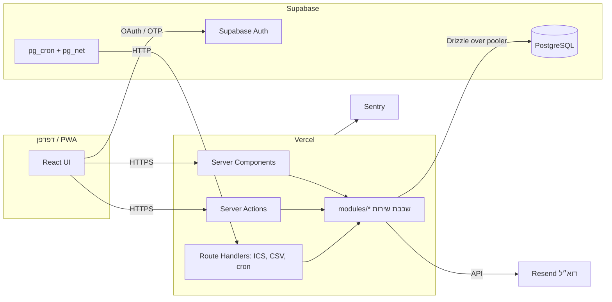

# מערכת תיאום חדרים — מסמך עיצוב טכני (Design Doc)

**גרסה:** 1.0  
**תאריך:** 3 בספטמבר 2026  
**מבוסס על:** `plans.md` גרסה 1.3  
**קהל יעד:** המפתח/ת של ה-MVP  
**מסמך המשך:** `implementation.md`

---

## 1. מטרה והיקף

מסמך זה מתרגם את האפיון לעיצוב טכני קונקרטי: ארכיטקטורה, סטאק, מבנה קוד, סכמת מסד נתונים, האלגוריתמים המרכזיים, ממשקי השרת, עיצוב הממשק והאבטחה. הוא נכתב למפתח יחיד שבונה MVP לעסק קטן, ולכן בכל צומת נבחרה האפשרות הפשוטה ביותר שעדיין נכונה.

**עקרונות מנחים**

1. **שכבת שירות אחת.** כל כלל עסקי חי ב-`src/modules/*`. רכיבי UI, Server Actions ונתיבי HTTP הם מעטפות דקות.
2. **מסד הנתונים הוא קו ההגנה האחרון.** אילוצים (exclusion, check, unique) מבטיחים נכונות גם אם קוד יעקוף בדיקה.
3. **הדפדפן לא נוגע במסד הנתונים.** רק שרת Next.js מדבר עם Postgres.
4. **צמצום נתונים בשרת.** DTO למטפל נבנה בשירות, לא ב-UI.
5. **UTC לאירועים, זמן מקומי לכללים.** כל timestamp נשמר ב-UTC; שעות פעילות וססיות בזמן מקומי של המתחם.

## 2. סקירת ארכיטקטורה



**זרימת בקשה טיפוסית (יצירת הזמנה):**

1. הלקוח קורא ל-Server Action `createBooking` עם `{ id, roomId, startAtLocal, note }`.
2. ה-Action בונה `Actor` מהסשן (`requireUser()`), מוודא קלט ב-zod, וקורא ל-`bookings.create(actor, input)`.
3. השירות פותח טרנזקציה, נועל את החדר, מריץ בדיקות, כותב הזמנה + אירוע ביקורת + שורת הודעה, ומבצע commit.
4. אחרי commit, `after()` מפעיל את שולח ההודעות שמנסה לשלוח את הדוא״ל מיד.
5. ה-Action מחזיר `{ ok: true, booking }` או `{ ok: false, code, details }`. הלקוח מרענן את היומן.

## 3. סטאק ונימוקים

| שכבה | בחירה | נימוק |
|---|---|---|
| Framework | Next.js 15, App Router, React 19, TypeScript | שרת ולקוח במאגר אחד; Server Actions חוסכים API נפרד; פריסה ל-Vercel ללא תצורה. |
| UI | Tailwind CSS 4 + shadcn/ui | רכיבים נגישים (Radix) עם תמיכת RTL דרך `dir`; ללא ספריית יומן חיצונית. |
| טפסים | react-hook-form + zod | סכמות zod משותפות לשרת וללקוח. |
| i18n | next-intl | תמיכה ב-`[locale]` בנתיב, בפורמט תאריכים לפי שפה, ב-RTL. |
| זמן | date-fns 4 + `@date-fns/tz` | המרות אזור זמן קלות, ללא תלות כבדה. |
| הזדהות | Supabase Auth (`@supabase/ssr`) | Google + OTP בדוא״ל מוכנים; סשן ב-cookies. |
| מסד נתונים | Supabase Postgres | Postgres מנוהל עם גיבויים, pg_cron, pg_net. |
| גישה לנתונים | Drizzle ORM + `postgres` driver | טרנזקציות, advisory locks ו-SQL גולמי כשצריך; migrations בקבצי SQL. |
| דוא״ל | Resend + React Email | API פשוט, תבניות React, דומיין מאומת. |
| ICS | הפקה ידנית (פונקציה קטנה) | פורמט פשוט; חוסך תלות. |
| CSV | הפקה ידנית | קובץ קטן, escaping פשוט, BOM. |
| ניטור | `@sentry/nextjs` | שגיאות שרת ולקוח. |
| בדיקות | Vitest, Playwright, Testing Library | Unit + Integration מול Postgres מקומי + E2E. |
| אירוח | Vercel + Supabase Pro | Pro נדרש בגלל גיבויים ומניעת השהיית פרויקט. |

**למה לא Supabase JS client + RLS מהדפדפן?** כללי ההזמנה דורשים טרנזקציה ונעילה, ואי-אפשר לבטא אותם ב-RLS. שכבת שירות אחת בשרת פשוטה יותר לבדיקה ולביקורת. RLS מופעל בכל זאת על כל הטבלאות **ללא מדיניות**, כך שמפתח ה-anon אינו יכול לקרוא דבר.

**למה לא ספריית יומן (FullCalendar וכד׳)?** התצוגה היא רשת של חדרים × רבעי שעה ליום אחד. זה רכיב קטן שקל לבנות, ושליטה מלאה ב-RTL, במובייל ובנגישות שווה יותר מהספרייה.

## 4. מבנה הפרויקט

```text
rooms/
  drizzle/                    # migrations (SQL) שנוצרו מ-drizzle-kit
  messages/
    he.json
    en.json
  public/
    manifest.webmanifest
    icons/
  src/
    app/
      [locale]/
        (public)/
          login/
          privacy/
          terms/
        (app)/                # דורש התחברות
          layout.tsx          # shell, בורר מתחם, ניווט
          onboarding/         # שם, שפה, בקשת חברות
          calendar/[siteId]/  # יומן יום
          bookings/           # ההזמנות שלי, פרטי הזמנה
          profile/
          admin/
            dashboard/
            calendar/[siteId]/
            members/
            bookings/
            series/
            rooms/
            hours/
            closures/
            reports/
            settings/
            audit/
      api/
        auth/callback/route.ts        # Supabase OAuth/OTP callback
        bookings/[id]/ics/route.ts
        reports/[report].csv/route.ts
        cron/notifications/route.ts
      layout.tsx
    modules/                  # לוגיקה עסקית; אין ייבוא מ-app/
      auth/                   # Actor, requireUser, requireAdmin, requireMembership
      users/
      memberships/
      sites/
      rooms/
      opening-hours/
      closures/
      availability/           # חישוב זמינות יומית ו-DTO
      bookings/               # create/move/cancel, בדיקות, נעילה
      recurrence/             # expand, preview, create, split, cancel
      notifications/          # outbox, sender, templates
      ics/
      reports/
      audit/
    lib/
      db/                     # drizzle client, schema.ts, tx helper, advisory lock
      supabase/               # server/browser clients
      errors.ts               # AppError + codes
      result.ts               # ActionResult<T>
      time/                   # המרות זמן מקומי/UTC, slots, ranges
      validation/             # סכמות zod משותפות
      i18n/                   # next-intl config, routing
    components/
      ui/                     # shadcn
      calendar/               # DayGrid, DayList, RoomColumn, TimeBlock, BookingDialog
      forms/
      layout/
  tests/
    unit/
    integration/
    e2e/
```

**כלל תלות:** `app/` → `modules/` → `lib/`. `modules/` לעולם לא מייבא מ-`app/` או מ-`components/`.

## 5. הזדהות, זהות והרשאות

### 5.1 זרימת התחברות

- Supabase Auth עם שני ספקים: Google OAuth ו-Email OTP (קוד בן 6 ספרות; Magic Link אותו מנגנון).
- `@supabase/ssr` שומר את הסשן ב-cookies. `middleware.ts` מרענן את הטוקן בכל בקשה ומפנה משתמש לא מזוהה ל-`/login`.
- `/api/auth/callback` מחליף `code` בסשן ומפנה ל-`/onboarding` או ל-`/calendar`.
- Supabase מקשר אוטומטית זהות Google לזהות דוא״ל עם אותה כתובת מאומתת. אין קוד קישור מותאם.

### 5.2 שורת המשתמש באפליקציה

טבלת `users` באפליקציה (סכמה `public`) עם `id` זהה ל-`auth.users.id`. הפרובישן נעשה בקוד ולא בטריגר, בפונקציה `ensureAppUser()`:

```ts
// modules/auth/actor.ts
export async function getActor(): Promise<Actor | null> {
  const { data: { user } } = await supabaseServer().auth.getUser();   // מאמת JWT מול Supabase
  if (!user) return null;
  const appUser = await users.ensure({                                 // upsert אם חסר
    id: user.id, email: user.email!, emailVerified: !!user.email_confirmed_at,
  });
  return {
    userId: appUser.id, role: appUser.globalRole, locale: appUser.preferredLocale,
    status: appUser.status, memberships: await memberships.forUser(appUser.id),
    requestId: headers().get('x-request-id') ?? randomUUID(),
  };
}
```

`users.ensure` מעניק `SUPER_ADMIN` אם `email` מאומת ושווה ל-`SUPER_ADMIN_EMAIL` ואין עדיין מנהל-על. ההענקה נרשמת ב-`audit_events` עם `action = 'ROLE_GRANTED'`.

### 5.3 Actor והרשאות

```ts
type Actor = {
  userId: string;
  role: 'THERAPIST' | 'SUPER_ADMIN';
  status: 'ACTIVE' | 'DISABLED';
  locale: 'he' | 'en';
  memberships: { siteId: string; status: MembershipStatus }[];
  requestId: string;
};

// modules/auth/guards.ts
requireUser(): Actor                       // 401 UNAUTHENTICATED, או FORBIDDEN אם DISABLED
requireAdmin(actor): void                  // FORBIDDEN
requireApprovedMember(actor, siteId): void // מנהל עובר תמיד; אחרת דורש APPROVED
canManageBooking(actor, booking): boolean  // מנהל תמיד; בעלים רק אם עתידי ורגיל/ביטול מופע
```

כל פונקציית שירות מקבלת `actor` כפרמטר ראשון וקוראת ל-guard בתחילתה. אין פונקציית שירות ציבורית ללא `actor`, למעט הרצות cron שמקבלות `SYSTEM_ACTOR`.

### 5.4 מנהל-על וחברות

מנהל-העל אינו זקוק לחברות. אם הבעלים גם מטפל, נוצרת לו חברות `APPROVED` (המנהל יכול לאשר את עצמו). בטופס „הזמנה עבור מטפל” הרשימה כוללת את כל החברים המאושרים במתחם.

## 6. סכמת מסד הנתונים

### 6.1 DDL

```sql
create extension if not exists btree_gist;

create type global_role        as enum ('THERAPIST', 'SUPER_ADMIN');
create type user_status        as enum ('ACTIVE', 'DISABLED');
create type membership_status  as enum ('PENDING', 'APPROVED', 'REJECTED', 'SUSPENDED');
create type active_status      as enum ('ACTIVE', 'INACTIVE');
create type booking_type       as enum ('REGULAR', 'SERIES');
create type booking_status     as enum ('CONFIRMED', 'CANCELLED');
create type series_status      as enum ('ACTIVE', 'ENDED', 'CANCELLED');
create type notification_status as enum ('PENDING', 'SENT', 'FAILED');

create table users (
  id               uuid primary key,                 -- = auth.users.id
  email            text not null unique,
  full_name        text,
  preferred_locale text not null default 'he' check (preferred_locale in ('he','en')),
  global_role      global_role not null default 'THERAPIST',
  status           user_status not null default 'ACTIVE',
  created_at       timestamptz not null default now(),
  updated_at       timestamptz not null default now()
);
create unique index users_single_super_admin on users ((true)) where global_role = 'SUPER_ADMIN';

create table sites (
  id                          uuid primary key default gen_random_uuid(),
  name                        text not null,
  address                     text not null,
  timezone                    text not null default 'Asia/Jerusalem',
  booking_window_days         int  not null default 90 check (booking_window_days between 1 and 365),
  cancellation_cutoff_minutes int  not null default 0  check (cancellation_cutoff_minutes >= 0),
  status                      active_status not null default 'ACTIVE',
  created_at                  timestamptz not null default now(),
  updated_at                  timestamptz not null default now()
);

create table site_memberships (
  id           uuid primary key default gen_random_uuid(),
  site_id      uuid not null references sites(id),
  user_id      uuid not null references users(id),
  status       membership_status not null default 'PENDING',
  requested_at timestamptz not null default now(),
  decided_at   timestamptz,
  decided_by   uuid references users(id),
  unique (site_id, user_id)
);
create index site_memberships_site_status on site_memberships (site_id, status);

create table rooms (
  id            uuid primary key default gen_random_uuid(),
  site_id       uuid not null references sites(id),
  room_number   text not null,
  display_order int  not null default 0,
  status        active_status not null default 'ACTIVE',
  created_at    timestamptz not null default now(),
  updated_at    timestamptz not null default now(),
  unique (site_id, room_number)
);

create table opening_hours (
  id         uuid primary key default gen_random_uuid(),
  site_id    uuid not null references sites(id),
  weekday    smallint not null check (weekday between 0 and 6),   -- 0 = ראשון
  start_time time not null,
  end_time   time not null,
  check (start_time < end_time),
  unique (site_id, weekday, start_time)
);
-- אי-חפיפת מקטעים באותו יום נאכפת בשירות (הטופס שומר את כל היום בבת אחת).

create table closures (
  id         uuid primary key default gen_random_uuid(),
  site_id    uuid not null references sites(id),
  room_id    uuid references rooms(id),                -- null = כל המתחם
  start_at   timestamptz not null,
  end_at     timestamptz not null,
  reason     text,
  created_by uuid not null references users(id),
  created_at timestamptz not null default now(),
  check (start_at < end_at)
);
create index closures_site_range on closures using gist (site_id, tstzrange(start_at, end_at, '[)'));

create table recurrence_series (
  id         uuid primary key default gen_random_uuid(),
  site_id    uuid not null references sites(id),
  room_id    uuid not null references rooms(id),
  user_id    uuid not null references users(id),
  weekday    smallint not null check (weekday between 0 and 6),
  start_time time not null,
  end_time   time not null,
  starts_on  date not null,
  ends_on    date not null,
  note       text,
  status     series_status not null default 'ACTIVE',
  created_by uuid not null references users(id),
  updated_by uuid not null references users(id),
  created_at timestamptz not null default now(),
  updated_at timestamptz not null default now(),
  check (start_time < end_time),
  check (ends_on >= starts_on and ends_on <= starts_on + 364)
);

create table bookings (
  id                  uuid primary key,                -- נוצר בלקוח
  site_id             uuid not null references sites(id),
  room_id             uuid not null references rooms(id),
  user_id             uuid not null references users(id),
  start_at            timestamptz not null,
  end_at              timestamptz not null,
  booking_type        booking_type not null,
  status              booking_status not null default 'CONFIRMED',
  note                text,
  series_id           uuid references recurrence_series(id),
  is_exception        boolean not null default false,
  version             int not null default 1,
  created_by          uuid not null references users(id),
  updated_by          uuid not null references users(id),
  cancelled_at        timestamptz,
  cancelled_by        uuid references users(id),
  cancellation_reason text,
  created_at          timestamptz not null default now(),
  updated_at          timestamptz not null default now(),
  check (start_at < end_at),
  check ((booking_type = 'SERIES') = (series_id is not null)),
  -- קו ההגנה האחרון: אין שתי הזמנות מאושרות חופפות באותו חדר
  exclude using gist (room_id with =, tstzrange(start_at, end_at, '[)') with &&)
    where (status = 'CONFIRMED')
);
create index bookings_room_start on bookings (room_id, start_at);
create index bookings_site_start on bookings (site_id, start_at);
create index bookings_user_start on bookings (user_id, start_at desc);
create index bookings_series     on bookings (series_id) where series_id is not null;

create table notifications (
  id         uuid primary key default gen_random_uuid(),
  user_id    uuid not null references users(id),
  type       text not null,
  locale     text not null,
  payload    jsonb not null,
  status     notification_status not null default 'PENDING',
  attempts   int not null default 0,
  last_error text,
  created_at timestamptz not null default now(),
  sent_at    timestamptz
);
create index notifications_pending on notifications (created_at) where status <> 'SENT';

create table audit_events (
  id            bigserial primary key,
  site_id       uuid references sites(id),
  actor_user_id uuid references users(id),           -- null = מערכת
  action        text not null,
  entity_type   text not null,
  entity_id     text not null,
  before        jsonb,
  after         jsonb,
  request_id    text,
  created_at    timestamptz not null default now()
);
create index audit_site_created on audit_events (site_id, created_at desc);
create index audit_entity       on audit_events (entity_type, entity_id);

-- RLS ללא מדיניות: חוסם את anon/authenticated לחלוטין. השרת מתחבר בתפקיד postgres.
alter table users            enable row level security;
alter table sites            enable row level security;
alter table site_memberships enable row level security;
alter table rooms            enable row level security;
alter table opening_hours    enable row level security;
alter table closures         enable row level security;
alter table recurrence_series enable row level security;
alter table bookings         enable row level security;
alter table notifications    enable row level security;
alter table audit_events     enable row level security;
```

### 6.2 הערות סכמה

- **`bookings.id` נוצר בלקוח.** יצירה עם `id` קיים של אותו משתמש ואותם פרטים מחזירה את הרשומה הקיימת (idempotent). `id` קיים עם פרטים אחרים מחזיר `VALIDATION`.
- **`version`** גדל בכל שינוי זמן/חדר ומשמש כ-`SEQUENCE` ב-ICS.
- **`is_exception`** נכון למופע ששונה בזמן/חדר או בוטל בנפרד מהסדרה.
- **מחיקה פיזית** מותרת רק לפיצול סדרה (11.3 באפיון) ורק למופעים עתידיים. כל מחיקה כזו מלווה באירוע ביקורת אחד לסדרה.
- **הזמנות `CANCELLED`** אינן משתתפות באילוץ ההדרה, ולכן משבצת מתפנה מיד עם הביטול.
- **`audit_events.before/after`** מכילים רק את השדות הרלוונטיים (למשל `{room_id, start_at, end_at, status}`), לא את כל הרשומה.

### 6.3 Drizzle

`src/lib/db/schema.ts` משקף את ה-DDL. ה-exclusion constraint וה-RLS נכתבים כ-SQL ידני בקובץ migration (Drizzle לא מייצר אותם). `drizzle-kit generate` ליצירת migrations ו-`drizzle-kit migrate` בהרצה. חיבור דרך Supavisor ב-transaction mode (פורט 6543) עם `prepare: false`.

## 7. זמן ואזור זמן

`src/lib/time/`:

```ts
const TZ = site.timezone; // 'Asia/Jerusalem'

localToUtc(date: 'YYYY-MM-DD', time: 'HH:mm', tz): Date   // TZDate → UTC instant
utcToLocal(instant: Date, tz): { date, time, weekday }
dayBounds(date, tz): { startUtc, endUtc }                   // [00:00, 24:00) מקומי
isOnQuarter(time: 'HH:mm'): boolean                          // דקות % 15 === 0
overlaps(a: Range, b: Range): boolean                        // a.start < b.end && b.start < a.end
containedIn(inner: Range, outer: Range): boolean
```

- כל השוואה בין טווחים נעשית על מופעי `Date` (UTC).
- מעבר שעון: הזמנה 02:00 ביום מעבר לשעון קיץ אינה קיימת מקומית; `localToUtc` מחזיר את הרגע התקף הבא, והשירות דוחה אם `utcToLocal(result).time !== time` (קוד `INVALID_LOCAL_TIME`). מופע ססיה בתאריך כזה מופיע בתצוגה המקדימה כהתנגשות מסוג `INVALID_LOCAL_TIME`.
- כל תצוגה לוקחת את `site.timezone`; אין שימוש באזור הזמן של הדפדפן.

## 8. לוגיקה עסקית מרכזית

### 8.1 זמינות יומית

```ts
// modules/availability/getDay.ts
getDayAvailability(actor, { siteId, date }): DayAvailability
```

1. `requireApprovedMember(actor, siteId)`.
2. שליפה בשאילתה אחת לכל ישות: מתחם, חדרים פעילים (לפי `display_order`), `opening_hours` ליום בשבוע, `closures` שחופפות ל-`dayBounds`, `bookings` `CONFIRMED` שחופפות ל-`dayBounds`.
3. לכל חדר בונים רשימת בלוקים ממוינת:
   - `OPEN` למקטעי הפעילות.
   - `CLOSED` לסגירות (של החדר או של המתחם).
   - `BUSY` להזמנה של אחר (למטפל) או `BOOKING` עם פרטים (למנהל) או `MINE` (הזמנה של המשתמש).
4. ה-DTO:

```ts
type DayAvailability = {
  siteId: string; date: string; timezone: string;
  bookingWindow: { fromUtc: string; toUtc: string };   // למטפל; למנהל null
  rooms: Array<{
    roomId: string; roomNumber: string;
    openSegments: Array<{ start: string; end: string }>;              // ISO UTC
    blocks: Array<
      | { kind: 'BUSY';    start: string; end: string }
      | { kind: 'CLOSED';  start: string; end: string; reason?: string }   // reason למנהל בלבד
      | { kind: 'MINE';    start: string; end: string; bookingId: string; type: BookingType; note?: string; seriesId?: string }
      | { kind: 'BOOKING'; start: string; end: string; bookingId: string; type: BookingType; note?: string; seriesId?: string;
          user: { id: string; fullName: string } }                          // מנהל בלבד
    >;
  }>;
};
```

הבדיקה `kind === 'BUSY'` היא היחידה שהלקוח של מטפל רואה עבור אחרים. בדיקת אינטגרציה מאמתת ש-JSON של מטפל אינו מכיל `user`, `note`, `bookingId` בבלוקים שאינם `MINE`.

**חישוב משבצות פנויות בלקוח:** הלקוח מחשב לכל חדר את שעות ההתחלה התקפות: כל רבע שעה `t` שבו `[t, t+60m)` מוכל במקטע `OPEN`, לא חופף `CLOSED`/`BUSY`/`MINE`/`BOOKING`, ו-`t` בתוך `bookingWindow` ובעתיד. זהו חישוב תצוגה בלבד; השרת חוזר על אותן בדיקות.

### 8.2 בדיקות משותפות להזמנה

```ts
// modules/bookings/validate.ts
assertBookable(tx, { actor, site, room, range, ignoreBookingId? })
```

סדר הבדיקות והקוד שכל אחת זורקת:

| בדיקה | קוד | חל על |
|---|---|---|
| חדר פעיל ושייך למתחם | `NOT_FOUND` | כולם |
| למטפל חברות `APPROVED` במתחם (המזמין, לא הפועל) | `FORBIDDEN` / `MEMBER_NOT_APPROVED` | כולם |
| התחלה על רבע שעה בזמן מקומי | `INVALID_START_STEP` | כולם |
| טווח בתוך מקטע פעילות אחד | `OUTSIDE_OPENING_HOURS` | כולם |
| לא חופף סגירה | `CLOSED` | כולם |
| התחלה בעתיד | `PAST_START` | מטפל |
| התחלה בתוך `booking_window_days` | `OUTSIDE_BOOKING_WINDOW` | מטפל |
| לא חופף הזמנה `CONFIRMED` אחרת (מלבד `ignoreBookingId`) | `SLOT_TAKEN` | כולם |

### 8.3 יצירת הזמנה

```ts
createBooking(actor, { id, siteId, roomId, startAt, note, forUserId? })
```

```
tx:
  lockRoom(roomId)                              -- select pg_advisory_xact_lock(hashtext(roomId))
  existing = select * from bookings where id = $id
  if existing: return existing if same user+room+start, else VALIDATION
  forUserId != actor → requireAdmin
  assertBookable(...)
  insert booking (REGULAR, CONFIRMED, end = start + 60m)
  audit('BOOKING_CREATED')
  enqueue notification BOOKING_CREATED → user
commit
after(): notifications.flush()
```

אם ה-insert נכשל על האילוץ (`23P01`) הוא ממופה ל-`SLOT_TAKEN`. זה יקרה רק אם קוד עוקף את הנעילה.

### 8.4 שינוי הזמנה

```ts
moveBooking(actor, { bookingId, roomId, startAt })
```

```
tx:
  lockRooms(sort([oldRoom, newRoom]))
  b = select ... for update
  canManageBooking(actor, b) else FORBIDDEN     -- מטפל: רק REGULAR שלו, עתידי, לפני cutoff
  newEnd = startAt + (b.end - b.start)         -- שומר משך; ססיה שומרת משך מקורי
  assertBookable(..., ignoreBookingId = b.id)
  update bookings set room_id, start_at, end_at, version = version + 1,
         is_exception = (series_id is not null), updated_by
  audit('BOOKING_MOVED', before, after)
  if actor != b.user: enqueue BOOKING_CHANGED_BY_ADMIN
commit
```

### 8.5 ביטול

```ts
cancelBooking(actor, { bookingId, reason? })
```

- מטפל: הזמנה שלו, עתידית, לפני cutoff. עבור `SERIES` מותר רק אם ההגדרה `THERAPIST_CAN_CANCEL_OCCURRENCE=true` (ברירת מחדל). מסמן `is_exception`.
- מנהל: תמיד.
- `update ... set status = 'CANCELLED', cancelled_at, cancelled_by, cancellation_reason, version + 1`.
- ביקורת. הודעה: למטפל אם ביטל המנהל; למנהל אם מטפל ביטל מופע ססיה.

### 8.6 ססיות

**הרחבה (`expandSeries`)** — פונקציה טהורה:

```ts
expand({ weekday, startTime, endTime, startsOn, endsOn, tz }): Occurrence[]
// לכל תאריך d מ-startsOn עד endsOn שבו weekday(d) === weekday:
//   start = localToUtc(d, startTime), end = localToUtc(d, endTime)
//   אם המרה לא תקפה → { date: d, invalid: 'INVALID_LOCAL_TIME' }
```

**תצוגה מקדימה (`previewSeries`)**:

1. `requireAdmin`; ולידציה (משך 60–720 דקות, רבעי שעה, עד 52 שבועות, מטפל מאושר במתחם).
2. `expand`.
3. שליפה אחת: `opening_hours` של המתחם, `closures` ו-`bookings` `CONFIRMED` של החדר בטווח `[first.start, last.end)`.
4. לכל מופע: בדיקת מקטע פעילות, סגירה, חפיפה (עם `excludeSeriesId` בעריכה). תוצאה: `{ date, start, end, conflict?: { code, with?: {...} } }`.
5. מחזיר `{ occurrences, conflictCount, freeCount }`. ללא כתיבה.

**יצירה (`createSeries`)**:

```
tx:
  lockRoom(roomId)
  preview = previewSeries(...)                    -- שוב, בתוך הנעילה
  if conflicts and !input.skipConflicts: throw CONFLICTS(preview)
  insert recurrence_series
  bulk insert bookings for free occurrences (SERIES, CONFIRMED, series_id)
  audit('SERIES_CREATED', after = { ..., created: n, skipped: dates[] })
  enqueue SERIES_CREATED → user (סיכום: יום, שעות, טווח, תאריכים שדולגו)
commit
```

**מופע זה בלבד:** `moveBooking` / `cancelBooking` על ה-booking, מסמן `is_exception`.

**מופע זה והבאים (`splitSeries`)**:

```ts
splitSeries(actor, { seriesId, fromDate, changes: { roomId?, weekday?, startTime?, endTime?, userId?, endsOn?, note? }, skipConflicts })
```

```
tx:
  lockRooms(sort([old.room, new.room]))
  old = select ... for update; require ACTIVE and fromDate > today and fromDate within [starts_on, ends_on]
  delete from bookings where series_id = old.id and start_at >= dayBounds(fromDate).startUtc
     (כולל חריגים; מספר השורות נשמר לביקורת)
  update old set ends_on = fromDate - 1, status = ENDED if ends_on < starts_on → CANCELLED
  newInput = { ...old, ...changes, startsOn: fromDate }
  preview מול המצב אחרי המחיקה (excludeSeriesId לא נדרש כי המופעים נמחקו)
  if conflicts and !skipConflicts: rollback, throw CONFLICTS(preview)
  insert new series + bookings
  audit('SERIES_SPLIT', before = {old, deleted: n}, after = {new, created: m, skipped})
  enqueue SERIES_CHANGED → user (ולמטפל הישן אם המטפל השתנה: SERIES_CANCELLED)
commit
```

ההודעה מציגה למנהל שהמופעים מ-`fromDate` ייווצרו מחדש ושחריגים יאבדו, לפני האישור.

**ביטול סדרה (`cancelSeries`)**: `update bookings set status = CANCELLED, cancelled_by, reason = 'SERIES_CANCELLED' where series_id and start_at >= now()`; `series.status = CANCELLED`; ביקורת; הודעה אחת.

**סיום אוטומטי:** `status = ENDED` נקבע בקריאה (`ends_on < today`) ולא צריך cron.

### 8.7 סגירות

```ts
createClosure(actor, { siteId, roomId?, startAt, endAt, reason, cancelConflicts: boolean })
```

```
tx:
  rooms = roomId ? [roomId] : activeRooms(siteId)
  lockRooms(sort(rooms))
  conflicts = bookings CONFIRMED in rooms overlapping [startAt, endAt)
  if conflicts.length and !cancelConflicts: throw CONFLICTS(list with user names)
  for each conflict: cancel (cancelled_by = actor, reason = 'CLOSURE: ' + reason), enqueue BOOKING_CANCELLED_BY_CLOSURE
  insert closure
  audit('CLOSURE_CREATED', after = { ..., cancelledBookings: ids })
commit
```

`deleteClosure` מוחק פיזית (סגירה אינה רשומה היסטורית) ורושם ביקורת.

### 8.8 חדרים ושעות פעילות

- `deactivateRoom`: אם קיימות הזמנות `CONFIRMED` עם `start_at >= now()` → `ROOM_HAS_FUTURE_BOOKINGS` עם הרשימה.
- `setOpeningHours(siteId, weekday, segments[])`: מוחק ומכניס את מקטעי היום בטרנזקציה; בודק אי-חפיפה ומיון; מחזיר `warnings` עם הזמנות עתידיות שיוצאות מחוץ לשעות החדשות (לא חוסם).

### 8.9 נעילה

```ts
// lib/db/locks.ts
export const lockRoom  = (tx, roomId: string) => tx.execute(sql`select pg_advisory_xact_lock(hashtext(${roomId}))`);
export const lockRooms = (tx, ids: string[]) => [...new Set(ids)].sort().reduce((p, id) => p.then(() => lockRoom(tx, id)), Promise.resolve());
```

הנעילה משוחררת אוטומטית ב-commit/rollback. הסדר הקבוע מונע deadlock בין שינוי בין חדרים לסגירת מתחם.

## 9. ממשקי שרת

### 9.1 Server Actions

כל Action ב-`src/app/**/actions.ts` עם `'use server'`, מקבל קלט לא-מאומת, ומחזיר:

```ts
type ActionResult<T> =
  | { ok: true; data: T }
  | { ok: false; code: ErrorCode; message: string; details?: unknown; requestId: string };
```

תבנית:

```ts
export async function createBookingAction(raw: unknown): Promise<ActionResult<BookingDto>> {
  return runAction(async () => {
    const actor = await requireUser();
    const input = createBookingSchema.parse(raw);
    const booking = await bookings.create(actor, input);
    revalidatePath(`/[locale]/calendar/${input.siteId}`);
    return toBookingDto(booking);
  });
}
```

`runAction` תופס `AppError` וממפה ל-`ok: false`, תופס `ZodError` ל-`VALIDATION`, ושולח כל שגיאה אחרת ל-Sentry ומחזיר `INTERNAL`.

| Action | קלט | הרשאה |
|---|---|---|
| `updateProfile` | fullName, locale | משתמש |
| `requestMembership` | siteId | משתמש |
| `decideMembership` | membershipId, status | מנהל |
| `updateSite` | siteId, name, address, bookingWindowDays, cancellationCutoffMinutes | מנהל |
| `setOpeningHours` | siteId, weekday, segments[] | מנהל |
| `createRoom` / `updateRoom` / `reorderRooms` / `setRoomStatus` | … | מנהל |
| `createBooking` | id, siteId, roomId, startAt, note, forUserId? | חבר / מנהל |
| `moveBooking` | bookingId, roomId, startAt | בעלים / מנהל |
| `cancelBooking` | bookingId, reason? | בעלים / מנהל |
| `previewSeries` / `createSeries` / `splitSeries` / `cancelSeries` | … | מנהל |
| `createClosure` / `deleteClosure` | … | מנהל |

### 9.2 קריאות

Server Components קוראים ישירות לשירותים: `availability.getDay`, `bookings.listMine`, `bookings.get`, `memberships.listForSite`, `series.list`, `closures.list`, `reports.hoursSummary`, `reports.bookingsDetail`, `audit.list`. הרשאות נבדקות בשירות, לא ב-page.

### 9.3 Route Handlers

| נתיב | הרשאה | תוכן |
|---|---|---|
| `GET /api/auth/callback` | ציבורי | החלפת code בסשן |
| `GET /api/bookings/[id]/ics` | בעלים / מנהל | `text/calendar`, `Content-Disposition: attachment` |
| `GET /api/reports/hours.csv?…` / `bookings.csv?…` | מנהל | `text/csv; charset=utf-8` עם BOM |
| `POST /api/cron/notifications` | `Authorization: Bearer ${CRON_SECRET}` | שליחה חוזרת של הודעות ממתינות |

### 9.4 קודי שגיאה

```ts
type ErrorCode =
  | 'UNAUTHENTICATED' | 'FORBIDDEN' | 'NOT_FOUND' | 'VALIDATION' | 'INTERNAL'
  | 'MEMBER_NOT_APPROVED' | 'SLOT_TAKEN' | 'OUTSIDE_OPENING_HOURS' | 'CLOSED'
  | 'OUTSIDE_BOOKING_WINDOW' | 'PAST_START' | 'INVALID_START_STEP' | 'INVALID_LOCAL_TIME'
  | 'CONFLICTS' | 'ROOM_HAS_FUTURE_BOOKINGS' | 'CUTOFF_PASSED';
```

הודעות מתורגמות בלקוח לפי `code` (`messages/*.json` תחת `errors.*`). `details` של `CONFLICTS` מכיל רשימה מובנית להצגה.

## 10. הודעות (דוא״ל)

### 10.1 Outbox

כל שירות שמייצר אירוע כותב שורה ל-`notifications` באותה טרנזקציה:

```ts
enqueue(tx, { userId, type: 'BOOKING_CREATED', locale, payload: { siteName, roomNumber, startAt, endAt, bookingId, ... } })
```

`payload` הוא מינימלי ומכיל את כל מה שהתבנית צריכה, כדי שהשליחה לא תלויה במצב הנוכחי (הזמנה יכולה להשתנות עד שהמייל נשלח).

### 10.2 שליחה

```ts
// modules/notifications/sender.ts
flush(limit = 20): לוקח שורות PENDING/FAILED עם attempts < 5, לפי created_at,
  עם `for update skip locked`; לכל שורה: render(template[type], locale, payload) → resend.send();
  הצלחה → SENT + sent_at; כשל → FAILED, attempts + 1, last_error.
```

- אחרי כל Action שהוסיף הודעה: `after(() => flush())` (Next.js `after`), כך שברוב המקרים המייל יוצא בתוך שניות.
- `POST /api/cron/notifications` קורא ל-`flush()` כל 10 דקות. מופעל מ-Supabase `pg_cron` + `pg_net` (חינמי) או מ-Vercel Cron (דורש Pro). מסמך המימוש מפרט.
- הודעה שנכשלה 5 פעמים נשארת `FAILED`; Sentry מקבל אירוע.

### 10.3 תבניות

React Email ב-`modules/notifications/templates/`, תבנית לכל `type`, עם `locale` ו-`dir`. תוכן: כותרת, מתחם, חדר, תאריך ושעות מקומיות, סוג השינוי, קישור לפרטי ההזמנה. אירועי הזמנה מצרפים קובץ ICS.

סוגים: `MEMBERSHIP_REQUESTED` (למנהל), `MEMBERSHIP_DECIDED`, `BOOKING_CREATED`, `BOOKING_CHANGED_BY_ADMIN`, `BOOKING_CANCELLED_BY_ADMIN`, `BOOKING_CANCELLED_BY_CLOSURE`, `SERIES_CREATED`, `SERIES_CHANGED`, `SERIES_CANCELLED`, `OCCURRENCE_CANCELLED_BY_THERAPIST` (למנהל).

## 11. ICS

```ts
// modules/ics/build.ts
buildIcs(booking, site): string
```

- `UID: ${booking.id}@${APP_HOST}`, `SEQUENCE: ${booking.version}`.
- `DTSTART;TZID=Asia/Jerusalem:YYYYMMDDTHHMMSS` עם בלוק `VTIMEZONE` סטטי ל-`Asia/Jerusalem`.
- `SUMMARY`: „חדר {n} — {site}” בשפת המשתמש; `LOCATION`: כתובת המתחם; `DESCRIPTION`: קישור לפרטי ההזמנה. ללא הערה תפעולית.
- `STATUS:CANCELLED` + `METHOD:CANCEL` כשההזמנה בוטלה (מצורף למייל ביטול).

## 12. דוחות ו-CSV

### 12.1 סיכום שעות

```sql
select u.id, u.full_name, r.id, r.room_number, s.id, s.name,
       b.booking_type,
       sum(extract(epoch from (b.end_at - b.start_at)) / 3600) as hours,
       count(*) as bookings
from bookings b join users u on u.id = b.user_id join rooms r on r.id = b.room_id join sites s on s.id = b.site_id
where b.status = 'CONFIRMED' and b.start_at >= $from and b.start_at < $to and ($siteId is null or b.site_id = $siteId)
group by 1,2,3,4,5,6,7
```

ה-UI מציג שתי טבלאות (לפי מטפל, לפי חדר) מאותה תוצאה, עם עמודות רגילות/ססיה/סה״כ. טווח ברירת מחדל: החודש הנוכחי.

### 12.2 פירוט הזמנות

רשימה מדופדפת (100 בעמוד) עם מסננים: טווח, מתחם, חדר, מטפל, סוג, מצב. עמודות: תאריך, שעות, מתחם, חדר, מטפל, סוג, מצב, נוצר בידי, בוטל בידי, זמן ביטול, סיבה, הערה.

### 12.3 CSV

```ts
toCsv(rows, headers): string  // '\uFEFF' + שורות, ערכים ב-quotes עם escaping של "
```

כותרות מתורגמות. תאריכים ושעות בזמן מקומי בפורמט `YYYY-MM-DD` ו-`HH:mm`. הורדה דרך Route Handler עם `Content-Disposition: attachment; filename*=UTF-8''...`.

## 13. יומן ביקורת

```ts
audit(tx, { actor, siteId?, action, entityType, entityId, before?, after? })
```

`action` הוא string קבוע (`BOOKING_CREATED`, `BOOKING_MOVED`, `BOOKING_CANCELLED`, `SERIES_CREATED`, `SERIES_SPLIT`, `SERIES_CANCELLED`, `CLOSURE_CREATED`, `CLOSURE_DELETED`, `MEMBERSHIP_DECIDED`, `ROOM_CREATED`, `ROOM_UPDATED`, `SITE_UPDATED`, `OPENING_HOURS_SET`, `ROLE_GRANTED`). מסך הביקורת מציג רשימה מדופדפת עם מסננים: מתחם, סוג ישות, טווח תאריכים, מבצע. לחיצה על שורה מציגה `before`/`after` כ-JSON מעוצב.

## 14. ממשק משתמש

### 14.1 Shell

- `[locale]/(app)/layout.tsx`: סרגל עליון עם שם המערכת, בורר מתחם (רק אם למשתמש יותר ממתחם מאושר אחד, או מנהל), קישורים: יומן, ההזמנות שלי, פרופיל; למנהל תפריט ניהול.
- `dir` ו-`lang` על `<html>` לפי locale. Tailwind עם מאפיינים לוגיים (`ms-`, `me-`, `ps-`, `text-start`).
- מצב הגלובלי מינימלי: מתחם נבחר (URL), תאריך נבחר (URL `?date=`).

### 14.2 יומן יום

**`DayGrid` (≥ 768px):**

- CSS Grid: עמודת זמן + עמודה לכל חדר. שורה לכל 15 דקות, בגובה 12px (שעה = 48px). תוויות שעה כל 60 דקות.
- טווח השעות של הרשת: מהמקטע המוקדם ביותר עד המאוחר ביותר באותו יום; אם אין שעות פעילות, מסך „המתחם סגור היום”.
- בלוקים (`TimeBlock`) ממוקמים ב-`grid-row: start / end` לפי אינדקס רבע השעה. `BUSY`/`CLOSED`/`OUTSIDE` ברקע מפוספס ותווית טקסט; `MINE` בצבע מודגש עם שעות, ולמנהל `BOOKING` עם שם.
- לחיצה על תא פנוי פותחת `BookingDialog` עם חדר ושעת התחלה. אם `[t, t+60)` אינו תקף, התא מוצג כ-disabled עם tooltip (למשל „לא נשאר זמן עד סוף הפעילות”).
- הרשת ניתנת לניווט במקלדת: כל תא פנוי הוא `button` עם `aria-label` „חדר 3, 09:15, פנוי”. חיצים נעים בין תאים.

**`DayList` (< 768px):**

- Tabs לחדרים (Radix Tabs, ניתן לגלילה אופקית).
- רשימה כרונולוגית: פרקי `OPEN` רציפים ממוזגים לשורה „פנוי 09:00–12:00” עם כפתור „בחר שעה” שפותח `Select` עם שעות ההתחלה התקפות; בלוקי `MINE` עם פעולות; `BUSY`/`CLOSED` כשורות מידע.

**`BookingDialog`:** מציג מתחם, חדר, תאריך, שעת התחלה (ניתנת לשינוי ל-Select של רבעי שעה תקפים), שעת סיום מחושבת, שדה הערה עם האזהרה, כפתור אישור. למנהל גם בורר מטפל. בהצלחה: toast + „הוסף ליומן” (קישור ל-ICS). ב-`SLOT_TAKEN`: הודעה בתוך הדיאלוג, סגירה ורענון (`router.refresh()`).

**רענון:** אחרי כל Action `router.refresh()`. אין polling; בעסק קטן זה מספיק. אם משבצת נתפסה בינתיים, השרת מחזיר `SLOT_TAKEN` והמשתמש רואה הודעה ברורה.

### 14.3 ההזמנות שלי

שתי רשימות: עתידיות (ממוינות עולה) והיסטוריה (מדופדפת, יורדת). כרטיס: תאריך, שעות, מתחם, חדר, סוג (רגילה / ססיה), מצב. פעולות: פרטים, שינוי (רגילה עתידית), ביטול, ICS.

### 14.4 מסכי מנהל

- **לוח מצב:** לכל מתחם כרטיס עם מספר הזמנות היום ורשימה קצרה; בקשות ממתינות עם כפתורי אישור/דחייה.
- **חברים:** טבלה עם מסנן מצב, פעולות אישור/דחייה/השעיה/החזרה.
- **ססיות:** רשימה; טופס יצירה בשני שלבים (פרטים → תצוגה מקדימה עם רשימת מופעים והתנגשויות → אישור „צור את הפנויים בלבד”). עריכה פותחת בחירה „מופע זה בלבד” / „מופע זה והבאים” כשמגיעים מהיומן, או עריכת סדרה מתאריך כשמגיעים מרשימת הססיות.
- **שעות פעילות:** טבלה של 7 ימים, כל יום עם רשימת מקטעים וכפתור הוספה. שמירה ליום.
- **סגירות:** רשימה עתידית; טופס עם מתחם/חדר, טווח, סיבה. בתשובת `CONFLICTS`: רשימת ההזמנות המתנגשות, ו-checkbox „בטל את כל ההזמנות המתנגשות ושלח הודעה” שמפעיל שליחה חוזרת עם `cancelConflicts: true`.
- **דוחות:** טופס מסננים למעלה, טבלה, כפתור „הורד CSV” עם אזהרת מידע אישי.
- **ביקורת:** רשימה עם מסננים ופירוט.

### 14.5 מצבי ממשק

| מצב | טיפול |
|---|---|
| טעינה | `loading.tsx` עם skeleton לרשת היומן |
| יומן ריק / אין חדרים | Empty state עם הסבר; למנהל קישור לניהול חדרים |
| ממתין לאישור | עמוד `onboarding/pending` עם מצב לכל מתחם וכפתור בקשה למתחם נוסף |
| נדחה / מושעה | אותו עמוד עם הסבר ואפשרות בקשה חוזרת (לנדחה) |
| שגיאת רשת | `error.tsx` עם „נסה שוב” |
| offline | באנר קטן דרך `navigator.onLine` |
| `SLOT_TAKEN` | הודעה בדיאלוג + רענון |
| `CONFLICTS` | רשימה מובנית בתוך הטופס |

### 14.6 נגישות

- כל אינטראקציה בכפתור אמיתי או קישור. Radix מספק focus trap ו-`aria` לדיאלוגים.
- ניגודיות: פלטת shadcn ברירת מחדל (עוברת AA). מצב לא מוצג בצבע בלבד: תווית טקסט או סמל בכל בלוק.
- `aria-live="polite"` לאזור toast.
- מיקוד נראה (`focus-visible` ring).

## 15. i18n

- next-intl עם `[locale]` בנתיב (`/he/...`, `/en/...`). ברירת מחדל `he`. הפניה לפי `preferred_locale` של המשתמש אחרי התחברות.
- `messages/he.json`, `messages/en.json` בהיררכיה לפי מסך. אין מחרוזות קשיחות ברכיבים (כלל ESLint `no-literal-strings` ברמת אזהרה).
- תאריכים: `Intl.DateTimeFormat` עם `timeZone: site.timezone` ו-`locale`. ימי שבוע בעברית: ראשון–שבת.
- דוא״ל: תבניות לפי `locale` של הנמען.
- CSV: כותרות לפי locale של המנהל.

## 16. PWA

- `public/manifest.webmanifest`: `name`, `short_name`, `start_url: /he/calendar`, `display: standalone`, `dir: rtl`, `lang: he`, אייקונים 192/512 ו-maskable, `theme_color`.
- `<link rel="manifest">` ו-`apple-touch-icon` ב-`layout.tsx`.
- Service Worker מינימלי (`public/sw.js`) שרק מותקן ומעביר בקשות לרשת, כדי לעמוד בדרישות ההתקנה בדפדפנים שעדיין דורשים אותו. ללא caching, ללא offline.
- באנר „התקן את האפליקציה” לא נדרש; ההתקנה דרך תפריט הדפדפן.

## 17. אבטחה

| נושא | מימוש |
|---|---|
| סשן | Supabase cookies: `HttpOnly`, `Secure`, `SameSite=Lax`; רענון ב-middleware |
| CSRF | Server Actions מאומתים לפי `Origin`/`Host` בידי Next.js; Route Handlers משנים (cron) דורשים Bearer |
| גישה לנתונים | רק השרת מתחבר ל-Postgres; `DATABASE_URL` ו-`SUPABASE_SERVICE_ROLE_KEY` לא נחשפים ללקוח; RLS מופעל ללא מדיניות |
| הרשאה | guards בשכבת השירות; בדיקות שליליות לכל Action מנהלי |
| צמצום מידע | DTO ב-`availability` וב-`bookings`; בדיקת אינטגרציה שמוודאת שאין שדות אסורים |
| סודות | Vercel env vars; `.env.local` ב-gitignore |
| לוגים | `requestId` בכל לוג; אין tokens, קודי OTP או payload של הודעות |
| כותרות | `Strict-Transport-Security`, `X-Content-Type-Options`, `Referrer-Policy`, CSP בסיסי ב-`next.config` |
| מחיקת משתמש | `users.status = DISABLED`, `full_name = 'משתמש שהוסר'`, `email = 'deleted+{id}@invalid'`; מחיקת המשתמש ב-Supabase Auth; הזמנות וביקורת נשארות |
| Google OAuth | מסך הסכמה עם קישורי `/privacy` ו-`/terms`; scopes: `email profile` |

## 18. בדיקות

### 18.1 Unit (Vitest)

- `lib/time`: `localToUtc`/`utcToLocal` כולל 2026-03-27 ו-2026-10-25 (מעברי שעון בישראל), `isOnQuarter`, `overlaps` על גבולות.
- `availability/slots`: חישוב שעות התחלה תקפות מול מקטעים, סגירות והזמנות.
- `recurrence/expand`: מופעים, גבולות כולל, תאריך לא תקף.
- `reports/hours`: חישוב שעות לססיה בת 3 שעות.
- `ics/build`, `csv`.

### 18.2 Integration (Vitest מול Postgres מקומי)

`tests/integration/` מריצים migrations על DB נקי (`supabase start` או Docker), מזריעים מתחם, חדרים, שעות ומשתמשים, וקוראים לשירותים עם `Actor` מפוברק:

- כל שורה בטבלת 8.2 (קוד שגיאה לכל כלל).
- תחרות: `Promise.all` של 20 `createBooking` לאותה משבצת → הזמנה אחת, 19 `SLOT_TAKEN`.
- Idempotency: אותו `id` פעמיים → אותה רשומה.
- `moveBooking` בין חדרים, כשל אטומי.
- `createSeries` עם התנגשות חלקית; `splitSeries`; `cancelSeries`.
- `createClosure` עם ובלי `cancelConflicts`.
- `deactivateRoom` עם הזמנה עתידית.
- DTO של מטפל אינו מכיל שדות אסורים.
- הרשאות שליליות: כל Action מנהלי עם `Actor` של מטפל → `FORBIDDEN`; מטפל מול הזמנה של אחר → `FORBIDDEN`/`NOT_FOUND`.
- outbox: `flush` עם שולח מזויף שנכשל → `FAILED`, attempts; הצלחה → `SENT`.

### 18.3 E2E (Playwright)

מול Supabase מקומי עם Mailpit (OTP נקרא מה-inbox המקומי). תרחישים: הרשמה ובקשת חברות; אישור בידי מנהל; הזמנה בדסקטופ ובמובייל (viewport 375); שינוי וביטול; ססיה עם חריג; סגירה עם ביטול מרוכז; בדיקת `page.on('response')` שאין `fullName` בתשובת זמינות של מטפל.

## 19. פריסה וסביבות

| סביבה | Next.js | Supabase | דוא״ל |
|---|---|---|---|
| local | `next dev` | `supabase start` (Docker) עם Mailpit | Resend במצב sandbox או לוג |
| preview | Vercel Preview per PR | פרויקט Supabase נפרד (dev) | Resend, דומיין test |
| production | Vercel Production | פרויקט Supabase Pro | Resend, דומיין מאומת |

משתני סביבה ורשימת הצעדים ב-`implementation.md`.

## 20. החלטות פתוחות ופשרות מודעות

1. **אין polling ביומן.** משתמש שהיומן שלו פתוח זמן רב עלול לראות מצב ישן; השרת דוחה התנגשות ומרענן. מקובל לעסק קטן.
2. **מחיקה פיזית בפיצול סדרה.** נבחרה כדי לא לזהם דוחות ביטולים; המידע נשמר ב-`audit_events`.
3. **`users.ensure` בכל בקשה.** upsert זול; אם יורגש בביצועים, cache לפי סשן.
4. **Service Worker מינימלי.** נשמר רק להתקנה; אם הדפדפנים המטרה לא דורשים אותו, ניתן להסיר.
5. **ביטול מופע ססיה בידי מטפל** נשלט בדגל `THERAPIST_CAN_CANCEL_OCCURRENCE` עד להחלטת הבעלים.
