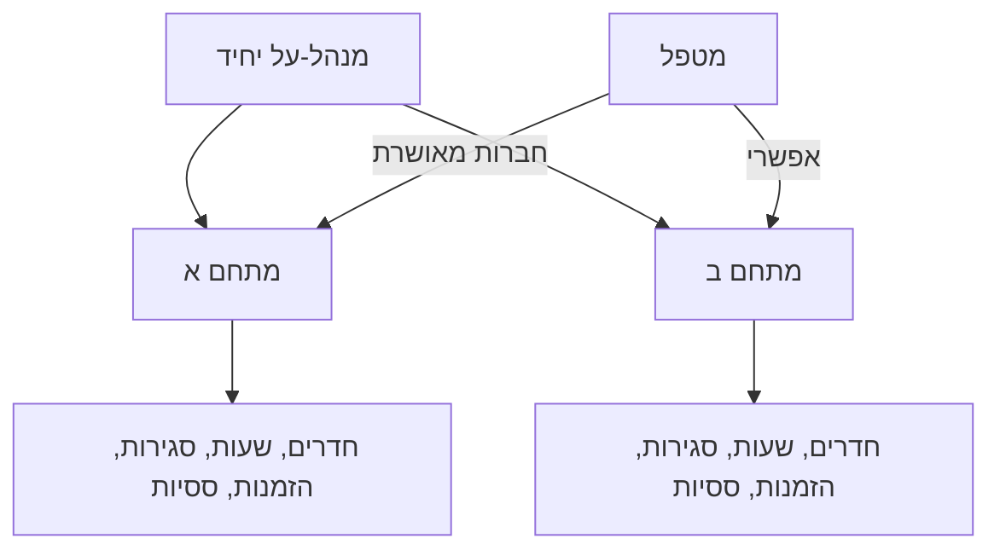
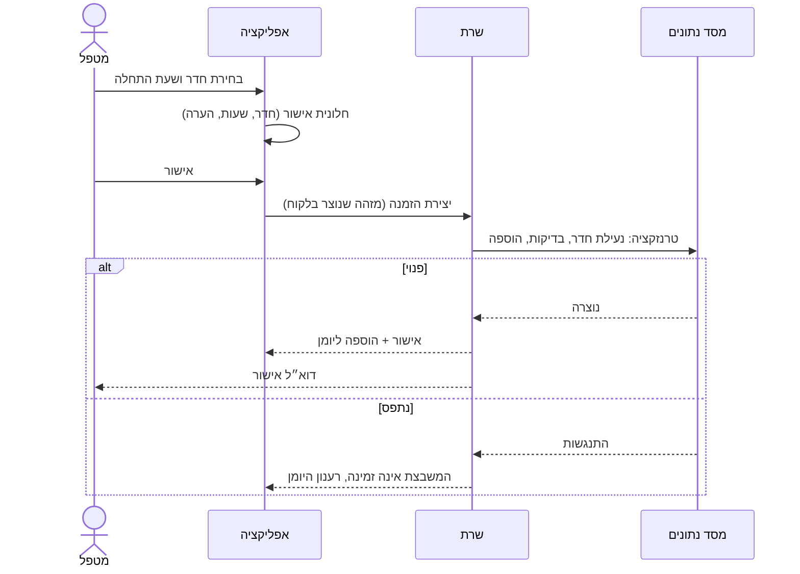
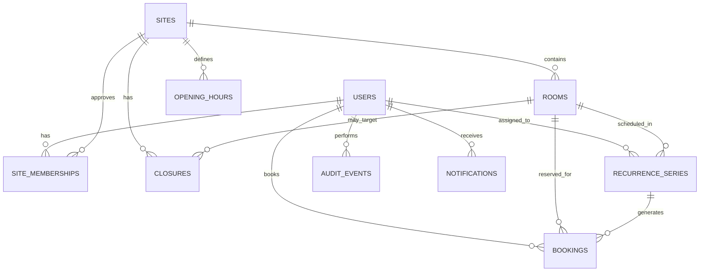

# אפיון מערכת לתיאום חדרי טיפול

**סטטוס:** אפיון מוצר וטכנולוגיה לגרסת MVP, מצומצם לעסק קטן  
**גרסה:** 1.3  
**תאריך:** 3 בספטמבר 2026  
**קהל יעד:** בעל המוצר, פיתוח, UX/UI ו-QA  
**שם זמני למוצר:** מערכת תיאום חדרים  
**מסמכים נלווים:** `design.md` (עיצוב טכני, Next.js + Supabase), `design-b.md` (חלופה: Firebase + Angular SPA), `implementation.md` (תכנית מימוש לחלופה א׳)

---

## 0. שינויים בגרסה 1.3 לעומת 1.2

המסמך נבדק מחדש תחת ההנחה שמדובר באפליקציה פנימית לעסק קטן: בעלים אחד, שני מתחמים, מספר חדרים קטן ועשרות עד מאות מטפלים. זה אינו שירות כללי, ולכן כל מנגנון שנועד לקנה מידה, לתחרות גבוהה על משאבים או לריבוי לקוחות הוסר או נדחה לשלב שני.

### 0.1 צומצם או הוסר

| # | פריט | החלטה | נימוק |
|---|---|---|---|
| 1 | החזקה זמנית (Hold) של 5 דקות | הוסר | יצירה אטומית עם אילוץ טווח במסד הנתונים מבטיחה אפס הזמנות כפולות. ההחזקה הוסיפה טבלה, cron לפקיעה, ספירה לאחור, שני מצבים ושלושה קריטריוני קבלה, ללא ערך ממשי כשמספר המטפלים המתחרים על משבצת קטן. |
| 2 | Apple Sign in ו-Facebook Login | שלב שני | דורשים חשבון מפתח בתשלום ואישור אפליקציה. Google ודוא״ל מכסים את כל המטפלים. |
| 3 | Web Push | שלב שני | דורש VAPID, Service Worker, ניהול subscriptions ותמיכה חלקית ב-iOS. דוא״ל הוא הערוץ התפעולי היחיד ב-MVP. |
| 4 | שעות פעילות ברמת חדר | שלב שני | שעות ברמת מתחם בלבד. חריגה קבועה לחדר תטופל בסגירה או בהשבתת חדר. |
| 5 | שישה דוחות ואחוז תפוסה | צומצם לשניים | סיכום שעות (לפי מטפל ולפי חדר) ופירוט הזמנות, שניהם עם CSV. אחוז תפוסה ודוח למטפל על נתוניו נדחו; „ההזמנות שלי” מכסה את הצורך של המטפל. |
| 6 | תצוגת שבוע | יעד משני | תצוגת יום היא ה-MVP. תצוגת שבוע לחדר יחיד תיבנה רק אם נשאר זמן לפני הפיילוט. |
| 7 | כותרת `Idempotency-Key` | הוחלף | מזהה ההזמנה נוצר בלקוח (UUID). ניסיון חוזר עם אותו מזהה מחזיר את ההזמנה הקיימת. |
| 8 | טבלת `auth_identities` וקישור זהויות ידני | הוסר | Supabase Auth מנהל זהויות ומקשר לפי דוא״ל מאומת. |
| 9 | יצוא ברקע, בדיקות עומס, יעדי P95, מסך בריאות למנהל, השבתת ספק הזדהות | הוסר | נפח הנתונים קטן. נותרו: בדיקת תחרות אחת על משבצת, ניטור שגיאות וגיבוי. |
| 10 | rate limiting מותאם | הוסר | Supabase Auth כולל הגבלות קצב מובנות. |
| 11 | מסך „הגדרות מערכת משותפות” | אוחד | ההגדרות (חלון הזמנה) יושבות בטופס המתחם. |
| 12 | דוח „הזמנות שבוטלו” ו„רגילות מול ססיה” | אוחד | מסננים בדוח פירוט ההזמנות. |
| 13 | שמירת גיבויים 14 יום | 7 ימים | ברירת המחדל של ספק מסד הנתונים המנוהל. |

### 0.2 נוסף או הובהר

1. **אתחול מנהל-העל:** כתובת דוא״ל אחת מוגדרת בהגדרות הסביבה; המשתמש שמתחבר איתה מקבל את התפקיד. אין ממשק להעברת תפקיד.
2. **מנהל והזמנות בעבר:** מנהל-העל רשאי ליצור ולתקן הזמנות בעבר ומעבר לחלון ההזמנה, אך לא מחוץ לשעות פעילות, לא בזמן סגירה ולא בחפיפה.
3. **ביטול מופע ססיה בידי מטפל:** מטפל רשאי לבטל מופע יחיד עתידי של ססיה שלו. מנהל-העל מקבל על כך הודעה. זו החלטה פתוחה לאישור הבעלים (ראו 29.2).
4. **השבתת חדר או השעיית מטפל:** לא ניתן להשבית חדר עם הזמנות עתידיות מאושרות; יש לטפל בהן קודם. השעיית מטפל אינה מבטלת הזמנות עתידיות; המנהל מבטל ידנית אם נדרש.
5. **אורך ססיה:** עד 52 שבועות מתאריך ההתחלה.
6. **„מופע זה והבאים”:** הוגדר כפיצול סדרה. המופעים העתידיים שהוחלפו נמחקים ומוחלפים במופעים חדשים, בתיעוד ביקורת. זה אינו ביטול ולא יופיע בדוח ביטולים.
7. **סגירה עם התנגשויות:** אפשרות אחת נוספת, „בטל את כל ההזמנות המתנגשות ושלח הודעה”. העברה של הזמנה בודדת נעשית דרך מסך ההזמנה.
8. **עמודי מדיניות פרטיות ותנאי שימוש:** נדרשים למסך ההסכמה של Google OAuth.
9. **שדות חדשים בהזמנה:** `is_exception` למופע ססיה ששונה, ו-`version` למספור עדכוני ICS.
10. **הזמנה מאוחרת של אותו יום:** מותר להזמין משבצת שמתחילה בעתיד גם אם היום כבר התחיל; אין מינימום התראה.

---

## 1. תקציר מנהלים

המערכת תאפשר למטפלים שאושרו מראש לצפות בזמינות חדרי טיפול בשני מתחמים, ליצור הזמנה רגילה בת 60 דקות, לשנות או לבטל אותה ולנהל את הזמנותיהם. ססיה שבועית קבועה, שמגדיר מנהל-העל, יכולה להימשך כמה שעות. מטפל רואה לגבי הזמנות של אחרים רק שהחדר תפוס.

מנהל-העל, הבעלים של שני המתחמים, מקבל ממשק ניהול עם מלוא פרטי ההזמנות. הוא מנהל חדרים, שעות פעילות, סגירות, משתמשים, הזמנות וססיות, מפיק שני דוחות שימוש וצופה ביומן ביקורת.

ה-MVP הוא אפליקציית ווב רספונסיבית הניתנת להתקנה כ-PWA, בעברית ובאנגלית, באזור הזמן `Asia/Jerusalem`. היא אינה שומרת פרטי מטופלים ואינה כוללת סליקה. ההתראות נשלחות בדוא״ל בלבד.

## 2. מטרות המוצר

### 2.1 מטרות עסקיות

1. לרכז את זמינות החדרים והזמנתם במערכת אחת.
2. לצמצם תיאומים ידניים והתנגשויות.
3. לתת למנהל-העל שליטה מלאה בשני המתחמים.
4. לשמור על פרטיות המטפלים כלפי מטפלים אחרים.
5. לספק תמונת שעות שימוש לפי מתחם, חדר ומטפל.
6. לאפשר למפתח יחיד להעלות MVP במהירות.

### 2.2 מדדי הצלחה

- אפס הזמנות כפולות לאותו חדר וזמן.
- רוב ההזמנות נעשות בידי המטפלים ללא מעורבות המנהל.
- אפס חשיפה של זהות מזמין למטפל אחר דרך הממשק או השרת.

## 3. תחום המערכת

### 3.1 כלול ב-MVP

- התחברות באמצעות Google או דוא״ל (קוד חד-פעמי / Magic Link).
- בקשת הצטרפות למתחם ואישור ידני.
- שני מתחמים תחת אותו מוצר.
- ניהול חדרים ושעות פעילות שבועיות ברמת מתחם, כולל כמה מקטעים ביום.
- סגירות של מתחם או חדר.
- יומן יום בדסקטופ ובמובייל.
- הזמנה רגילה בת 60 דקות, שינוי וביטול.
- ססיות שבועיות בטווח תאריכים, עם תצוגה מקדימה של התנגשויות.
- הודעות דוא״ל.
- הוספה ליומן באמצעות ICS.
- שני דוחות ויצוא CSV.
- יומן ביקורת.
- עברית ואנגלית, RTL/LTR.
- נגישות בסיסית: מקלדת, תוויות, ניגודיות, ללא הסתמכות על צבע.
- PWA ניתנת להתקנה (manifest ואייקונים).

### 3.2 מחוץ ל-MVP

החזקה זמנית של משבצת; Apple/Facebook Login; Web Push; WhatsApp; שעות פעילות לחדר; אחוז תפוסה ודוח PDF; תצוגת חודש; מטופלים ופרטיהם; תשלום וחשבוניות; רשימת המתנה; מרווח בין הזמנות; עבודה ללא אינטרנט; סנכרון דו-כיווני עם יומנים; אפליקציות מקוריות; Check-in ו-No-show; הזמנות ללא התחברות; העברת תפקיד מנהל דרך הממשק.

> **משמעות לדוחות:** ללא Check-in, המערכת מדווחת על שעות שהוזמנו. בדוחות יופיע המונח „שימוש מתוכנן”.

## 4. החלטות מוצר מאושרות

ערכים המסומנים כהגדרה ניתנים לשינוי ללא שינוי קוד.

1. שני תפקידים בלבד: מנהל-על ומטפל. (עודכן 3.9.2026: יכולים להיות כמה מנהלי-על; מנהל מקדם או מוריד מנהלים אחרים, והמנהל האחרון אינו ניתן להורדה. מנהל יכול גם להוסיף משתמשים ישירות.)
2. מנהל-העל מנהל את שני המתחמים ואינו זקוק לחברות בהם.
3. מטפל מחזיק חברות נפרדת לכל מתחם; מנהל-העל מאשר, דוחה או משעה.
4. זמני התחלה בקפיצות של 15 דקות. הזמנה רגילה נמשכת בדיוק 60 דקות. ססיה מוגדרת בשעת התחלה וסיום, בין שעה ל-12 שעות, באותו יום.
5. אין חלון הזמנה: מטפל יכול להזמין כל תאריך עתידי. (עודכן 4.9.2026; במקור 90 יום.)
6. מטפל משנה או מבטל עד שעת ההתחלה (הגדרה: דקות לפני ההתחלה, ברירת מחדל 0). אחרי כן רק מנהל-העל.
7. אין החזקה זמנית. יצירת הזמנה היא פעולה אטומית אחת; אם המשבצת נתפסה בינתיים המשתמש מקבל הודעה ורענון.
8. מותר למטפל להזמין כמה חדרים חופפים.
9. להזמנה שדה הערה תפעולית אופציונלי עם אזהרה שאין להזין פרטי מטופלים.
10. בססיה ניתן לערוך „מופע זה בלבד” או „מופע זה והבאים”.
11. סגירה גוברת על זמינות רגילה, אך אינה מבטלת הזמנות קיימות ללא החלטה מפורשת של המנהל.
12. עברית היא שפת ברירת המחדל; אנגלית נתמכת במלואה.
13. קנה מידה: מאות משתמשים, חדרים בודדים, שני מתחמים.
14. מנהל-העל מאותחל לפי כתובת דוא״ל בהגדרות הסביבה.
15. ססיה נמשכת עד 52 שבועות.
16. מנהל-העל רשאי ליצור ולתקן הזמנות בעבר ומעבר לחלון ההזמנה, ללא חפיפה, בתוך שעות פעילות ומחוץ לסגירות.

## 5. מושגים

- **מתחם:** ישות תפעולית עם כתובת, חדרים, שעות פעילות ומשתמשים מאושרים.
- **חדר:** משאב בר-הזמנה בתוך מתחם, מזוהה במספר חדר.
- **מטפל:** משתמש מאושר שמזמין חדר לעצמו.
- **מנהל-על:** הבעלים והמנהל היחיד, עם גישה מלאה לשני המתחמים.
- **חברות במתחם:** הקשר בין מטפל למתחם ומצב האישור שלו.
- **הזמנה רגילה:** הקצאת חדר למטפל ל-60 דקות.
- **ססיה:** סדרה שבועית קבועה למטפל, בחדר ובטווח שעות קבועים, בין תאריך התחלה לתאריך סיום.
- **מופע:** הזמנה יחידה שנוצרה מססיה.
- **חריג:** מופע ששונה או בוטל בנפרד מהסדרה.
- **סגירה:** פרק זמן שבו מתחם או חדר אינם זמינים.

## 6. הרשאות

### 6.1 מודל הבעלות



### 6.2 מטריצת הרשאות

| פעולה | מטפל | מנהל-על |
|---|:---:|:---:|
| צפייה בזמינות במתחם מאושר | כן | כן, בשני המתחמים |
| צפייה בזהות מזמין אחר | לא | כן |
| יצירת הזמנה לעצמו | כן | כן, אם הוא חבר במתחם |
| יצירת הזמנה עבור מטפל | לא | כן |
| שינוי/ביטול הזמנה עצמית עתידית | כן | כן |
| שינוי/ביטול הזמנה של אחר | לא | כן |
| ביטול מופע יחיד עתידי של ססיה שלו | כן (ראו 29.2) | כן |
| שינוי מופע ססיה, יצירה וניהול ססיה | לא | כן |
| ניהול חדרים, שעות וסגירות | לא | כן |
| אישור, דחייה והשעיה של מטפל | לא | כן |
| דוחות | לא | כן |
| יומן ביקורת | לא | כן |

### 6.3 כללים מחייבים

- הרשאה נאכפת בשרת. הסתרת רכיב בממשק אינה מנגנון הרשאה.
- הדפדפן אינו ניגש למסד הנתונים ישירות. כל קריאה עוברת דרך שכבת שירות בשרת שמצמצמת את הנתונים לפי התפקיד.
- מטפל מקבל נתוני תפוסה מצומצמים: ללא שם, מזהה, הערה או סוג הזמנה של אחר.
- השעיית חברות מונעת הזמנות חדשות באותו מתחם ואינה נוגעת בהיסטוריה או בהזמנות עתידיות.

## 7. הרשמה, התחברות ואישור

### 7.1 שיטות הזדהות

- Google OAuth.
- דוא״ל עם קוד חד-פעמי או Magic Link. אין סיסמה מקומית.

שתי השיטות מנוהלות בידי ספק ההזדהות של הפלטפורמה. משתמש שהתחבר ב-Google ואחר כך בדוא״ל עם אותה כתובת מאומתת מקושר לאותו חשבון בידי הספק.

### 7.2 פרטי משתמש

שם מלא, דוא״ל מאומת, שפה מועדפת. לא נשמרים מקצוע, רישיון, טלפון או מידע רפואי.

### 7.3 תהליך הצטרפות

1. המשתמש מזדהה.
2. בהתחברות ראשונה הוא משלים שם ושפה.
3. הוא בוחר מתחם אחד או שניים ושולח בקשת הצטרפות לכל אחד.
4. הבקשה במצב `PENDING`; מנהל-העל מקבל דוא״ל.
5. מנהל-העל מאשר או דוחה; המטפל מקבל דוא״ל.
6. חברות `APPROVED` פותחת את יומן המתחם.

מצבי חברות: `PENDING`, `APPROVED`, `REJECTED`, `SUSPENDED`. מטפל שנדחה יכול לשלוח בקשה חדשה.

### 7.4 אתחול מנהל-העל

כתובת דוא״ל אחת מוגדרת במשתני הסביבה. בהתחברות ראשונה של משתמש עם כתובת מאומתת זהה, הוא מקבל את תפקיד מנהל-העל. שינוי המנהל נעשה בעדכון ההגדרה ובפעולה ידנית במסד הנתונים, ומתועד.

## 8. מתחמים, חדרים, שעות פעילות וסגירות

### 8.1 מתחם

מזהה, שם, כתובת, אזור זמן (`Asia/Jerusalem`), חלון הזמנה בימים (90), דקות חסימת שינוי לפני התחלה (0), מצב פעיל/מושבת. שני המתחמים נוצרים בנתוני ההקמה.

### 8.2 חדר

מזהה, מתחם, מספר חדר, סדר תצוגה, מצב פעיל/מושבת. „מתחם + מספר חדר” ייחודי. לא ניתן להשבית חדר שיש לו הזמנות עתידיות מאושרות; המערכת מציגה אותן והמנהל מטפל בהן קודם.

### 8.3 שעות פעילות

- שעות שבועיות לכל מתחם, לפי יום בשבוע.
- כמה מקטעים ביום מותרים, למשל 08:00–13:00 ו-15:00–21:00. מקטעים אינם חופפים.
- הזמנה חייבת להיות מוכלת במלואה במקטע אחד.
- אין טיפול מיוחד בחגים; המנהל יוצר סגירה.
- שינוי שעות פעילות אינו נוגע בהזמנות קיימות; המערכת מציגה אזהרה אם יש הזמנות עתידיות מחוץ לשעות החדשות.

### 8.4 סגירות

סגירה חלה על מתחם שלם או חדר יחיד, לטווח זמן רציף (שעות, יום או כמה ימים).

כאשר סגירה חדשה מתנגשת בהזמנות מאושרות, המערכת מציגה את רשימת ההתנגשויות והמנהל בוחר:

- לבטל את הסגירה.
- לבטל את כל ההזמנות המתנגשות בפעולה אחת, עם סיבה, והמטפלים מקבלים דוא״ל.
- לצאת, להעביר או לבטל הזמנות בודדות דרך מסך ההזמנה, ולנסות שוב.

סגירה לא נשמרת כל עוד יש התנגשות.

## 9. יומן וזמינות

### 9.1 עקרונות

- גישה ליומן מחייבת חברות מאושרת במתחם (או תפקיד מנהל-על).
- מטפל רואה לכל חדר: פנוי, תפוס, סגור, מחוץ לשעות פעילות.
- הזמנה של המשתמש עצמו מוצגת עם פרטיה ופעולות.
- הזמנה של אחר מוצגת כ„תפוס” בלבד.
- מנהל-העל רואה שם מטפל, סוג, שעות והערה.
- סטטוס מוצג בטקסט או סמל ולא בצבע בלבד.

### 9.2 תצוגות

**דסקטופ:** תצוגת יום, חדרים כעמודות וזמן כשורות. ניווט יום קדימה ואחורה, „היום” ובורר תאריך. בורר מתחם למי שמאושר בשניהם.

**מובייל:** יום אחד, חדרים בבורר אופקי, רשימה כרונולוגית של פרקי זמן. פרק פנוי רציף מוצג כשורה אחת עם בחירת שעת התחלה. כל פעולה זמינה בכפתור.

**תצוגת שבוע** לחדר יחיד היא יעד משני.

### 9.3 ניווט בזמן

- מטפל מדפדף מהיום ועד סוף חלון ההזמנה. ההיסטוריה שלו זמינה ב„ההזמנות שלי”.
- מנהל-העל מדפדף ללא הגבלה.

## 10. הזמנה רגילה

### 10.1 כללים

- משך 60 דקות, התחלה בכל 15 דקות בזמן מקומי.
- בתוך מקטע פעילות, מחוץ לסגירה, בתוך חלון ההזמנה (למטפל).
- שעת ההתחלה בעתיד (למטפל).
- גבולות חצי-פתוחים `[start, end)`: 10:00–11:00 אינו מתנגש ב-11:00–12:00.
- אין חפיפה בין שתי הזמנות מאושרות באותו חדר, בשום מקרה. הכלל נאכף באילוץ במסד הנתונים.
- אין מרווח אוטומטי; אין הגבלה על חפיפה של אותו מטפל בחדרים שונים.

### 10.2 תהליך



### 10.3 שדות

מתחם, חדר, מטפל, התחלה וסיום, סוג (רגילה/מופע ססיה), מצב, הערה, מזהה סדרה וסימון חריג, יוצר ומעדכן אחרון, זמני יצירה/עדכון/ביטול, מבטל, סיבת ביטול, מספר גרסה.

### 10.4 מצבים

- `CONFIRMED`: הזמנה מאושרת.
- `CANCELLED`: מבוטלת, נשמרת להיסטוריה.

„הסתיימה” מחושב לפי הזמן ואינו מצב.

### 10.5 שינוי

- מטפל משנה חדר או שעה בהזמנה רגילה עתידית שלו.
- השינוי אטומי: אם היעד תפוס, המקור נשאר.
- מנהל-העל משנה כל הזמנה, גם אחרי תחילתה. שינוי מנהלי שולח דוא״ל למטפל ונרשם בביקורת.
- שינוי אינו יוצר חפיפה. במקום זאת המנהל מעביר או מבטל את ההזמנה המתנגשת.
- שינוי מופע ססיה מסמן אותו כחריג.

### 10.6 ביטול

- מטפל מבטל הזמנה רגילה שלו, ומופע ססיה שלו, עד שעת ההתחלה.
- ביטול משאיר את הרשומה במצב `CANCELLED`.
- מנהל-העל מבטל בכל עת, עם סיבה אופציונלית, והמטפל מקבל דוא״ל.

## 11. ססיות שבועיות

### 11.1 הגדרה

מתחם, חדר, מטפל מאושר במתחם, יום בשבוע, שעת התחלה וסיום (בקפיצות של 15 דקות, שעה עד 12 שעות, באותו יום, בתוך מקטע פעילות אחד), תאריך התחלה וסיום (כולל, עד 52 שבועות), הערה, מצב (`ACTIVE`, `ENDED`, `CANCELLED`).

רק מנהל-העל יוצר, משנה או מבטל ססיה.

### 11.2 יצירה

1. המנהל מזין פרטים ומבקש תצוגה מקדימה.
2. המערכת מחשבת את כל המופעים ובודקת כל אחד מול שעות פעילות, סגירות והזמנות קיימות.
3. אם אין התנגשויות, כל המופעים נוצרים כהזמנות מאושרות המקושרות לסדרה.
4. אם יש, מוצגת רשימה לפי תאריך וסיבה. המנהל בוחר: ביטול, או יצירת המופעים הפנויים בלבד. תאריכים שדולגו מוצגים בפרטי הסדרה.
5. המטפל מקבל דוא״ל אחד עם סיכום.

המערכת אינה מזיזה ואינה מבטלת הזמנות קיימות באופן אוטומטי.

### 11.3 שינוי וביטול

- **מופע זה בלבד:** משנה או מבטל הזמנה אחת ומסמן אותה כחריג. הסדרה אינה משתנה.
- **מופע זה והבאים:** הסדרה הקיימת מסתיימת ביום שלפני התאריך שנבחר. נוצרת סדרה חדשה עם הפרטים המעודכנים מאותו תאריך, עם תצוגה מקדימה והתנגשויות כמו ביצירה. המופעים העתידיים של הסדרה הישנה, כולל חריגים, נמחקים ומוחלפים. הפעולה נרשמת בביקורת עם מספר המופעים שהוחלפו.
- **ביטול סדרה:** המופעים העתידיים מבוטלים (`CANCELLED`), העבר נשאר.
- כל שינוי שולח דוא״ל אחד למטפל.

## 12. הודעות ויומן חיצוני

### 12.1 אירועים

| אירוע | נמען |
|---|---|
| בקשת הצטרפות חדשה | מנהל-העל |
| אישור / דחייה / השעיה | המטפל |
| הזמנה נוצרה (בידי המטפל או בידי מנהל עבורו) | המטפל |
| הזמנה שונתה או בוטלה בידי מנהל | המטפל |
| ססיה נוצרה, שונתה או בוטלה | המטפל |
| סגירה ביטלה הזמנה | המטפל |
| מטפל ביטל מופע ססיה | מנהל-העל |

אין תזכורות לפני ההזמנה. אין הודעה למנהל על הזמנה רגילה שמטפל יצר או ביטל.

### 12.2 כללים

- דוא״ל תפעולי אינו ניתן לביטול בידי המשתמש.
- כשל בשליחה אינו מבטל את הפעולה. ההודעה נשמרת, נשלחת שוב אוטומטית ומתועדת.
- הודעה כוללת מתחם, מספר חדר, תאריך, שעות וסוג השינוי, בשפת הנמען. לעולם לא פרטי מטופל.

### 12.3 ICS

- בכל הזמנה מאושרת: „הוספה ליומן”, קובץ ICS עם שם מתחם, מספר חדר, כתובת, שעות ומזהה יציב.
- אין סנכרון. דוא״ל על שינוי מצרף קובץ מעודכן עם מספר גרסה עולה, כך שיומנים תומכים מעדכנים את האירוע.

## 13. דוחות

### 13.1 דוחות MVP

1. **סיכום שעות:** שעות שימוש מתוכנן לפי מטפל ולפי חדר, בטווח תאריכים, למתחם אחד או מאוחד. מציג גם פיצול רגילות מול מופעי ססיה.
2. **פירוט הזמנות:** רשימת הזמנות בטווח תאריכים עם מסננים: מתחם, חדר, מטפל, סוג, מצב (כולל מבוטלות, מי ביטל ומתי).

לשני הדוחות יצוא CSV ב-UTF-8 עם BOM וכותרות בשפת המשתמש.

### 13.2 חישובים

- נספרות רק הזמנות `CONFIRMED`.
- הזמנה רגילה היא שעה. מופע ססיה נספר לפי משכו.
- הדוחות מכבדים תיקונים מנהליים כפי שנשמרו.
- כל דוח נושא את הכיתוב „שימוש מתוכנן”.

### 13.3 הרשאות

דוחות למנהל-העל בלבד. מטפל רואה את הזמנותיו ב„ההזמנות שלי”.

## 14. יומן ביקורת

נרשמים: שינויי מצב חברות; יצירה, שינוי וביטול של הזמנה; יצירה, שינוי, פיצול וביטול של ססיה; יצירה ושינוי של מתחם, חדר, שעות פעילות וסגירה; הענקת תפקיד מנהל-על.

לכל אירוע: סוג ישות, מזהה, פעולה, מבצע, זמן, ערכים קודמים וחדשים רלוונטיים ומזהה בקשה. אירועים לקריאה בלבד. מנהל-העל צופה בהם עם סינון לפי מתחם, ישות וטווח תאריכים.

## 15. מסכים

### 15.1 מטפל

1. התחברות (Google / דוא״ל).
2. השלמת שם ושפה.
3. בחירת מתחם ושליחת בקשה; מצב הבקשות.
4. יומן יום.
5. חלונית אישור הזמנה.
6. ההזמנות שלי: עתידיות והיסטוריה.
7. פרטי הזמנה: שינוי, ביטול, הוספה ליומן.
8. פרופיל: שם ושפה.

### 15.2 מנהל-על

1. לוח מצב: הזמנות היום בשני המתחמים ובקשות ממתינות.
2. יומן ניהול עם פרטי המזמינים ובורר מתחם.
3. בקשות הצטרפות וחברים (אישור, דחייה, השעיה).
4. יצירת הזמנה עבור מטפל ושינוי הזמנה קיימת.
5. ססיות: רשימה, יצירה עם תצוגה מקדימה, עריכה, ביטול.
6. חדרים.
7. שעות פעילות וסגירות, כולל פתרון התנגשויות.
8. דוחות ויצוא.
9. הגדרות מתחם.
10. יומן ביקורת.

### 15.3 מצבי ממשק

טעינה, יומן ריק, אין חדרים פעילים, משבצת שנתפסה במקביל, בקשת הצטרפות ממתינה/נדחתה/מושעית, שגיאת רשת, התנגשות בססיה או בסגירה, אזהרת הזמנות מחוץ לשעות חדשות.

## 16. דרישות פונקציונליות

### 16.1 הזדהות וחברות

- **AUTH-001:** כל מסך עסקי חסום למשתמש לא מזוהה.
- **AUTH-002:** תמיכה ב-Google ובדוא״ל.
- **AUTH-003:** מנהל-העל מאותחל לפי דוא״ל מוגדר.
- **MEM-001:** מצב חברות נפרד לכל מתחם.
- **MEM-002:** רק חברות `APPROVED` מאפשרת צפייה והזמנה.
- **MEM-003:** מנהל-העל מטפל בבקשות שני המתחמים.
- **MEM-004:** כל שינוי חברות נרשם בביקורת.

### 16.2 זמינות והזמנות

- **CAL-001:** זמינות לפי מתחם, חדר ויום.
- **CAL-002:** למטפל לא מוחזרים פרטי מזמין אחר.
- **CAL-003:** היומן מתרענן אחרי כל פעולה ואחרי התנגשות.
- **BKG-001:** הזמנה רגילה בת 60 דקות, התחלה ברבע שעה.
- **BKG-002:** אין חפיפה בחדר, נאכף במסד הנתונים.
- **BKG-003:** יצירה, שינוי וביטול אטומיים; כשל אינו משנה את המצב הקיים.
- **BKG-004:** ניסיון חוזר של יצירה עם אותו מזהה אינו יוצר הזמנה נוספת.
- **BKG-005:** מטפל מנהל רק הזמנות שלו, בחלון הזמן המותר.
- **BKG-006:** מנהל-העל מנהל כל הזמנה, גם בעבר.
- **BKG-007:** ביטול משאיר רשומה.

### 16.3 ססיות, שעות וסגירות

- **SES-001:** רק מנהל-העל יוצר ומשנה ססיה.
- **SES-002:** תצוגה מקדימה של כל המופעים וההתנגשויות לפני שמירה.
- **SES-003:** יצירת המופעים הפנויים בלבד רק לאחר אישור מפורש.
- **SES-004:** „מופע זה בלבד” ו„מופע זה והבאים” לפי 11.3.
- **SES-005:** משך ססיה שעה עד 12 שעות באותו יום; בדיקות, יומן ודוחות מתייחסים לכל המשך.
- **SES-006:** ססיה עד 52 שבועות.
- **HRS-001:** שעות פעילות שבועיות למתחם, כמה מקטעים ביום.
- **CLS-001:** סגירת חדר או מתחם לטווח זמן.
- **CLS-002:** סגירה אינה מבטלת הזמנה בלי בחירה מפורשת של המנהל.
- **CLS-003:** לא ניתן לשמור סגירה עם התנגשויות פתוחות.
- **ROOM-001:** לא ניתן להשבית חדר עם הזמנות עתידיות.

### 16.4 הודעות, דוחות וביקורת

- **NOT-001:** פעולות עסקיות מושלמות גם אם ספק הדוא״ל אינו זמין.
- **NOT-002:** הודעה שנכשלה נשלחת שוב אוטומטית.
- **REP-001:** דוחות למנהל-העל בלבד, לפי מתחם או מאוחד.
- **REP-002:** כל דוח מסומן „שימוש מתוכנן”.
- **REP-003:** יצוא CSV ב-UTF-8 עם BOM.
- **AUD-001:** שינויים מנהליים יוצרים אירוע ביקורת בלתי ניתן לעריכה.

## 17. מודל נתונים לוגי



### 17.1 ישויות

- **users:** `id` (זהה למזהה בספק ההזדהות), `email`, `full_name`, `preferred_locale`, `global_role`, `status`, timestamps.
- **sites:** `id`, `name`, `address`, `timezone`, `booking_window_days`, `cancellation_cutoff_minutes`, `status`, timestamps.
- **site_memberships:** `id`, `site_id`, `user_id`, `status`, `requested_at`, `decided_at`, `decided_by`. ייחודי על `site_id + user_id`.
- **rooms:** `id`, `site_id`, `room_number`, `display_order`, `status`, timestamps. ייחודי על `site_id + room_number`.
- **opening_hours:** `id`, `site_id`, `weekday`, `start_time`, `end_time`.
- **closures:** `id`, `site_id`, `room_id` (ריק = כל המתחם), `start_at`, `end_at`, `reason`, `created_by`, timestamps.
- **recurrence_series:** `id`, `site_id`, `room_id`, `user_id`, `weekday`, `start_time`, `end_time`, `starts_on`, `ends_on`, `note`, `status`, `created_by`, `updated_by`, timestamps.
- **bookings:** `id`, `site_id`, `room_id`, `user_id`, `start_at`, `end_at`, `booking_type`, `status`, `note`, `series_id`, `is_exception`, `version`, `created_by`, `updated_by`, `cancelled_at`, `cancelled_by`, `cancellation_reason`, timestamps. אילוץ: אין חפיפה של טווחים `CONFIRMED` באותו `room_id`.
- **notifications:** `id`, `user_id`, `type`, `locale`, `payload`, `status`, `attempts`, `last_error`, `created_at`, `sent_at`.
- **audit_events:** `id`, `site_id`, `actor_user_id`, `action`, `entity_type`, `entity_id`, `before`, `after`, `request_id`, `created_at`.

הפירוט המלא (DDL, אינדקסים, enums) ב-`design.md`.

### 17.2 זמן

- כל timestamps ב-UTC.
- שעות פעילות ושעות ססיה נשמרות כזמן מקומי; ההמרה לפי אזור הזמן של המתחם, כולל מעבר שעון.
- קפיצות 15 הדקות נבדקות בזמן מקומי.

## 18. ממשק שרת

הממשק ממומש כפעולות שרת (Server Actions) ומספר נתיבי HTTP להורדות. כל פעולה משנה עוברת אימות, בדיקת הרשאה, ולידציה, טרנזקציה וביקורת לפי הצורך.

### 18.1 פעולות

| תחום | פעולות |
|---|---|
| פרופיל | קריאה ועדכון שם ושפה |
| חברויות | בקשת הצטרפות; אישור, דחייה, השעיה (מנהל) |
| מתחם | עדכון הגדרות, שעות פעילות (מנהל) |
| חדרים | יצירה, עדכון, סדר, השבתה (מנהל) |
| זמינות | זמינות יומית למתחם, מצומצמת לפי תפקיד |
| הזמנות | יצירה (לעצמי / עבור מטפל), שינוי, ביטול, ההזמנות שלי, פרטים |
| ססיות | תצוגה מקדימה, יצירה, עריכת מופע, „מופע זה והבאים”, ביטול (מנהל) |
| סגירות | רשימה, יצירה עם פתרון התנגשויות, מחיקה (מנהל) |
| דוחות | סיכום שעות, פירוט הזמנות, CSV (מנהל) |
| ביקורת | רשימה עם מסננים (מנהל) |
| הורדות | ICS להזמנה, CSV לדוח |

### 18.2 צמצום מידע בזמינות

למטפל, פרק זמן תפוס של אחר מוחזר כ:

```json
{ "roomId": "...", "startAt": "...", "endAt": "...", "kind": "BUSY" }
```

ללא מזהה הזמנה, משתמש, שם, הערה, סוג או סדרה. הזמנה של המשתמש עצמו מוחזרת עם הפרטים הדרושים לניהולה.

### 18.3 שגיאות

כל שגיאה נושאת `code` יציב ו-`requestId`. קודים מרכזיים: `UNAUTHENTICATED`, `FORBIDDEN`, `NOT_FOUND`, `SLOT_TAKEN`, `OUTSIDE_OPENING_HOURS`, `CLOSED`, `OUTSIDE_BOOKING_WINDOW`, `PAST_START`, `INVALID_START_STEP`, `CONFLICTS` (עם רשימה), `ROOM_HAS_FUTURE_BOOKINGS`, `VALIDATION`.

## 19. מניעת התנגשויות

יצירה ושינוי של הזמנה, יצירת מופעי ססיה ויצירת סגירה מתבצעים בטרנזקציה אחת:

1. נעילה מייעצת (advisory lock) לפי מזהה חדר; בשינוי בין חדרים, שני החדרים בסדר מזהים קבוע.
2. בדיקות עסקיות: חברות, שעות פעילות, סגירות, חלון, חפיפה.
3. כתיבה. אילוץ הדרת טווח (exclusion constraint) על `room_id` וטווח הזמן של הזמנות `CONFIRMED` הוא קו ההגנה האחרון גם אם קוד עתידי ידלג על הבדיקות.
4. רישום ביקורת והודעה בתור, באותה טרנזקציה.
5. Commit; שליחת הדוא״ל מחוץ לטרנזקציה.

מזהה ההזמנה נוצר בלקוח. ניסיון חוזר לאחר timeout מחזיר את ההזמנה הקיימת.

## 20. אבטחה ופרטיות

- אין מידע על מטופלים; איסוף מידע אישי מינימלי.
- HTTPS בלבד. סשן ב-cookies מאובטחים (`HttpOnly`, `Secure`, `SameSite=Lax`).
- פעולות שרת מוגנות בבדיקת מקור מובנית של המסגרת.
- הדפדפן אינו ניגש למסד הנתונים; מפתח ה-anon של ספק ההזדהות משמש להזדהות בלבד, ו-RLS מופעל על כל הטבלאות ללא מדיניות, כך שגם דליפת המפתח אינה חושפת נתונים.
- סודות במשתני סביבה בלבד. הפרדה בין סביבת פיתוח לייצור.
- בשדה הערה: „אין להזין שמות, פרטים רפואיים או מידע מזהה של מטופלים”.
- יצוא דוח מכיל שמות מטפלים; מוצגת אזהרה לפני הורדה.
- לוגים ללא tokens, קישורי התחברות או תוכן הודעות.
- „מחיקת” משתמש היא השבתה ואנונימיזציה של שם ודוא״ל, תוך שמירת רשומות הזמנה וביקורת.
- עמודי מדיניות פרטיות ותנאי שימוש סטטיים.

## 21. דרישות לא-פונקציונליות

- **קיבולת:** מאות משתמשים, חדרים בודדים, אלפי הזמנות בשנה. אין יעדי ביצועים פורמליים; היומן צריך להיטען מהר בשימוש רגיל.
- **גיבוי:** גיבוי יומי אוטומטי של ספק מסד הנתונים, 7 ימים לפחות. תרגול שחזור אחד לפני ההשקה.
- **נגישות:** ניווט מקלדת ומיקוד נראה, תוויות לשדות ולכפתורים, ניגודיות תקינה, ללא הסתמכות על צבע, RTL/LTR.
- **מכשירים:** שתי הגרסאות האחרונות של Chrome ו-Safari (מחשב ומובייל), Edge ו-Firefox. רוחב מינימלי 320px. אזורי לחיצה כ-44px.
- **PWA:** manifest ואייקונים להתקנה. אין offline; בניתוק מוצגת הודעה.
- **לוקליזציה:** כל טקסט מקובצי תרגום. תאריכים ושעות לפי השפה, באזור הזמן של המתחם.

## 22. ארכיטקטורה

- **אפליקציה:** Next.js (App Router) עם TypeScript, שרת ולקוח במאגר אחד. קריאות ב-Server Components, כתיבות ב-Server Actions, שכבת שירות אחת לכל הלוגיקה העסקית.
- **מסד נתונים והזדהות:** Supabase (PostgreSQL + Auth עם Google ודוא״ל). גישה למסד מהשרת בלבד דרך ORM עם טרנזקציות.
- **אירוח:** Vercel.
- **דוא״ל:** ספק transactional (Resend) עם טבלת outbox ו-cron לניסיונות חוזרים.
- **ניטור:** Sentry ולוגי הפלטפורמה.

הפירוט ב-`design.md`.

## 23. תכנית MVP

| אבן דרך | תוכן |
|---|---|
| M0 יסודות | פרויקט, סכמה, migrations, הזדהות, פרופיל, מנהל-על, מתחמים, חדרים, חברויות, i18n ו-RTL |
| M1 ליבת הזמנות | שעות פעילות, סגירות, זמינות מצומצמת, יומן יום, יצירה/שינוי/ביטול, בדיקת תחרות, ההזמנות שלי, ICS |
| M2 ניהול | אישור מטפלים, יומן ניהול, הזמנה עבור מטפל, ססיות, סגירות עם התנגשויות, ביקורת |
| M3 תקשורת ודוחות | דוא״ל, דוחות ו-CSV, PWA, ליטוש נגישות |
| M4 ייצוב | E2E, בדיקות הרשאה שליליות, גיבוי ושחזור, ניטור, פיילוט במתחם אחד ואז השני |

הפירוט ב-`implementation.md`.

## 24. קריטריוני קבלה

### AC-01 פרטיות תפוסה
**בהינתן** שמטפל א׳ הזמין חדר, **כאשר** מטפל ב׳ צופה ביומן, **אז** הוא רואה „תפוס” בלבד ואינו מקבל מהשרת מזהה, שם, הערה או סוג.

### AC-02 הרשאת מתחם
**בהינתן** מטפל מאושר רק במתחם א׳, **כאשר** הוא מנסה לגשת לנתוני מתחם ב׳, **אז** הגישה נדחית ללא חשיפת מידע.

### AC-03 הזמנה במקביל
**בהינתן** חדר פנוי, **כאשר** 20 בקשות לאותה משבצת מגיעות בו-זמנית, **אז** נוצרת הזמנה אחת בלבד והשאר מקבלות `SLOT_TAKEN`.

### AC-04 ניסיון חוזר
**בהינתן** בקשת יצירה שהצליחה אך התשובה אבדה, **כאשר** הלקוח שולח שוב עם אותו מזהה, **אז** מוחזרת אותה הזמנה ולא נוצרת חדשה.

### AC-05 שינוי אטומי
**בהינתן** הזמנה קיימת, **כאשר** המשתמש מעביר אותה למשבצת תפוסה, **אז** הפעולה נכשלת והמקור נשאר.

### AC-06 גבול שעה
**בהינתן** הזמנה 10:00–11:00, **כאשר** משתמש מזמין 11:00–12:00 באותו חדר, **אז** ההזמנה מותרת.

### AC-07 שעות פעילות
**בהינתן** מתחם פעיל עד 20:00, **כאשר** משתמש מזמין 19:15–20:15, **אז** הפעולה נדחית.

### AC-08 חדרים חופפים
**בהינתן** למטפל הזמנה בחדר 1, **כאשר** הוא מזמין באותה שעה את חדר 2, **אז** מותר אם חדר 2 פנוי.

### AC-09 ססיה ללא התנגשות
**בהינתן** טווח פנוי, **כאשר** מנהל-העל יוצר ססיה 09:00–12:00, **אז** נוצרים כל המופעים באורך שלוש שעות, מקושרים לסדרה אחת, וכל הטווח חסום.

### AC-10 ססיה עם התנגשות
**בהינתן** שחלק מהמופעים מתנגשים, **כאשר** המנהל מבקש תצוגה מקדימה, **אז** מוצגים התאריכים המתנגשים והוא יכול לבטל או ליצור את הפנויים.

### AC-11 מופע יחיד
**בהינתן** ססיה פעילה, **כאשר** המנהל משנה מופע יחיד, **אז** היתר אינם משתנים והמופע מסומן כחריג.

### AC-12 מופע זה והבאים
**בהינתן** ססיה פעילה, **כאשר** המנהל משנה את שעת הסדרה מתאריך מסוים, **אז** המופעים לפני התאריך נשארים, המופעים מהתאריך והלאה מוחלפים בחדשים, ונרשם אירוע ביקורת.

### AC-13 סגירה מתנגשת
**בהינתן** הזמנות קיימות, **כאשר** המנהל סוגר את החדר באותו זמן, **אז** מוצגות ההתנגשויות והסגירה אינה נשמרת עד שהוא מבטל אותן במפורש או מטפל בהן.

### AC-14 שינוי מנהלי
**בהינתן** שמנהל שינה הזמנה של מטפל, **כאשר** השינוי נשמר, **אז** נשלח דוא״ל, נרשם אירוע ביקורת והיומן מתעדכן.

### AC-15 דוח
**בהינתן** מנהל-העל, **כאשר** הוא מפיק סיכום שעות למתחם א׳, **אז** הדוח כולל את מתחם א׳ בלבד, מסומן „שימוש מתוכנן”, וניתן להסיר את הסינון.

### AC-16 לוקליזציה
**בהינתן** משתמש שבחר אנגלית, **כאשר** הוא פותח את המערכת, **אז** הממשק באנגלית וב-LTR, והשעות באזור הזמן של ישראל.

### AC-17 השבתת חדר
**בהינתן** חדר עם הזמנה עתידית, **כאשר** המנהל מנסה להשבית אותו, **אז** הפעולה נדחית ומוצגת רשימת ההזמנות.

## 25. בדיקות

- **Unit:** חפיפה וגבולות `[start, end)`; חלון הזמנה; מקטעי פעילות; חישוב מופעי ססיה; המרות זמן סביב מעבר שעון; חישובי דוח כולל ססיות ארוכות.
- **Integration (מול Postgres):** הרשאות לפי תפקיד ומתחם; יצירה אטומית ותחרות של 20 בקשות; ניסיון חוזר; שינוי בין חדרים; ססיה חלקית; פיצול סדרה; סגירה עם ביטול מרוכז; outbox וניסיון חוזר; CSV בעברית.
- **End-to-end:** הרשמה, בקשה ואישור; הזמנה בדסקטופ ובמובייל; שינוי וביטול; ססיה וחריג; סגירה; אי-חשיפת פרטי מזמין בתעבורת הרשת.
- **הרשאות שליליות:** לכל פעולה מנהלית בדיקה שמטפל חסום; מטפל אינו קורא או משנה הזמנה של אחר.

## 26. ניטור ותפעול

- דיווח שגיאות (Sentry) בשרת ובלקוח.
- לוגים מובנים עם `requestId`, ללא מידע רגיש.
- התראה על כשל מתמשך בשליחת דוא״ל (הודעות במצב `FAILED` מעל סף).
- גיבוי יומי של הספק.

## 27. סיכונים

| סיכון | מענה |
|---|---|
| חשיפת זהות מזמין | DTO מצומצם בשכבת השירות, RLS ללא מדיניות, בדיקות הרשאה שליליות |
| הזמנה כפולה | טרנזקציה, נעילה לפי חדר ואילוץ הדרת טווח |
| מורכבות ססיות | מופעים מפורשים כהזמנות, תצוגה מקדימה, פיצול פשוט |
| בלבול בין מתוכנן לבפועל | כיתוב „שימוש מתוכנן”; Check-in בשלב שני |
| כשל דוא״ל | outbox, ניסיון חוזר, הפרדה מהטרנזקציה |
| טעויות שעון קיץ | UTC לאירועים, זמן מקומי לשעות, בדיקות DST |

## 28. שלב שני

Web Push; Apple/Facebook Login; WhatsApp; שעות פעילות לחדר; אחוז תפוסה ודוח PDF; תצוגת שבוע מלאה; Check-in ו-No-show; סנכרון יומנים דו-כיווני; אפליקציות מקוריות; פעולות מרוכזות; מדיניות שמירת נתונים.

## 29. החלטות ונתוני הקמה

### 29.1 החלטות שאומצו

1. שם העבודה „מערכת תיאום חדרים”, עיצוב ניטרלי.
2. חלון הזמנה 90 יום, ניתן לשינוי.
3. מטפל משנה או מבטל עד שעת ההתחלה.
4. Google ודוא״ל בלבד.
5. עברית ואנגלית מלאות.
6. CSV ב-MVP, PDF בשלב שני.
7. מנהל-על יחיד לשני המתחמים.
8. אין החזקה זמנית.
9. דוא״ל בלבד להודעות.

### 29.2 החלטות פתוחות לאישור הבעלים

1. **ביטול מופע ססיה בידי מטפל:** ברירת המחדל במסמך היא שמותר, עם הודעה למנהל. אם המתחם מחייב את המטפל על משבצת קבועה ללא קשר לביטול, אפשר לחסום זאת בהגדרה אחת.
2. **הודעה למנהל על כל הזמנה רגילה:** ברירת המחדל היא לא. ניתן להוסיף בקלות.
3. **שעת חסימת שינוי:** ברירת המחדל 0 דקות לפני ההתחלה. אם רוצים לחסום ביטול ביום ההזמנה, זו הגדרה למתחם.

### 29.3 נתוני הקמה

לפני העלאה לייצור: שמות וכתובות המתחמים, מספרי החדרים, שעות הפעילות, דוא״ל מנהל-העל, דומיין, כתובת שולח דוא״ל.

---

## נספח א׳ — Definition of Done ל-MVP

- כל קריטריוני הקבלה עוברים.
- אין ממצא אבטחה פתוח ברמה גבוהה.
- נבדקה הפרדת נתונים בין המתחמים ובין מטפלים.
- בדיקת תחרות של 20 בקשות יצרה הזמנה אחת.
- זרימות הליבה נבדקו ב-Chrome וב-Safari, במחשב ובמובייל, בעברית ובאנגלית.
- ניווט מקלדת בזרימת הזמנה בסיסית.
- גיבוי ושחזור עברו בהצלחה.
- הוגדרו דומיין, OAuth redirect, שולח דוא״ל מאומת (SPF/DKIM), דוא״ל מנהל-על.
- פיילוט במתחם אחד עם כמה מטפלים, ואז המתחם השני.

## נספח ב׳ — סדר עדיפויות אם צריך לקצר עוד

1. דוא״ל בלבד בהתחברות בתחילת הפיילוט; Google מיד אחריו.
2. יומן יום בלבד.
3. עברית מלאה; אנגלית לפני השקה רחבה.
4. דוח פירוט הזמנות לפני סיכום שעות.
5. יומן ביקורת בסיסי (רשימה בלי מסננים) לפני מסך מלא.
